

  <!-- 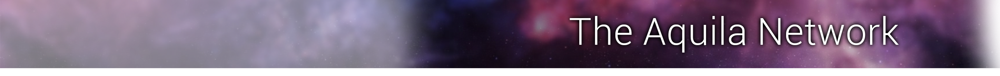 -->
  

  
<strong>Prefer an online interactive version of this archive with 15 translations? Browse <a href="https://fishy.moe/client-cheating-archive">fishy.moe</a>.</strong>
  

  <h1>
     osu! Cheat List 
  </h1>
  
<em>A directory of osu! private server cheat clients & hacks. Where to find them and what they do.</em>

  
<em>Created May 24, 2023 · Updated July 14, 2026</em>

  
  
  
  &nbsp;&nbsp;|&nbsp;&nbsp;
  
  
  
  
  
  

> [!CAUTION]
> Cheats are detectable on Bancho and most [private servers](https://hinamizawa.ai/osu/servers/). Accounts have been banned for using every client listed here. This directory is preserved for educational and archival purposes. Links to legacy clients are kept for historical reference, not endorsement. Use at your own risk.

  
  &nbsp;&nbsp;
  <a href="https://fishy.moe">
    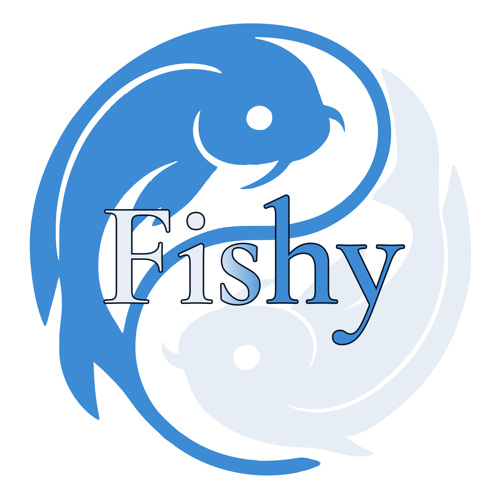
  </a>
  
<strong>The osu! <a href="https://hinamizawa.ai/osu/servers/">private servers</a> where these cheating clients are allowed are <a href="https://kawata.pw">kawata.pw</a></strong> (within their own cheat rules) <strong>and <a href="https://fishy.moe">fishy.moe</a></strong> (where we personally test them).

  
Bancho and every other <a href="https://hinamizawa.ai/osu/servers/">private server</a> detect and ban these clients on score submission!

  <!-- 
Any other cheating <a href="https://hinamizawa.ai/osu/servers/">private server</a> that is known also work, if the following is aloud in their rules/doc
 -->

## Contents

- [Active Clients](#active-clients)
  - [Arc](#arc)
  - [pawclient - pawinput](#pawclient)
  - [OSU!RISE](#osu-rise)
- [Under Maintenance](#under-maintenance)
  - [Aeris - Kawata](#kawata-aeris)
  - [Maple](#maple)
- [Under Development](#under-development)
  - [AQN Revived V3](#aqn-revived-v3)
  - [??????](#mystery-client)
- [Legacy / Archive](#legacy-archive)
  - [AQN V0 + V1 + V2](#aqn)
  - [freedom](#freedom)
  - [Ainu](#ainu)
  - [Auto Assist Megumi](#megumi)
  - [Abypass](#abypass)
  - [Skooter](#skooter)
  - [tuyosu](#tuyosu)
  - [paw!cheats](#paw-cheats)
  - [Shaymi](#shaymi)
  - [osu!rx](#osu-rx)
  - [OsuAuth](#osuauth)
  - [Clarity](#clarity)
  - [Saturn](#saturn)
  - [Iceware](#iceware)
  - [Lycoris](#lycoris)
- [Unknown](#unknown)
  - [JuicyBot](#juicybot)
- [Resources](#resources)
  - [Patched osu! b20220424](#patched-osu)
- [Feature comparison](#feature-comparison)
- [Want to test your own cheat?](#test-your-cheat)
- [Cheating Private Servers](#cheating-private-servers)
- [Play legit?](#play-legit)
- [osu! Mirrors](#osu-mirrors)
- [Contributing](#contributing)
- [Contributors](#contributors)

## 

### Arc

  

> _Standalone osu! client by Aochi._

- **Status:** Active · Free
- **History Preview:** [fishy.moe/arc](https://fishy.moe/client-cheating-archive#arc)
- **Maintainer:** [Aochi](https://github.com/7ez)
- **Download:** [fishy.moe/download/arc](https://fishy.moe/download/arc)
- **Discord:** [discord.gg/fSsxJdFa6h](https://discord.gg/fSsxJdFa6h)
- **Cheats:**
  - Maple Aim Assist (V1-V3)
  - Aim Correction
  - Relax Hack
  - Timewarp
  - AR Changer · CS Changer · HD Remover · FL Remover

> [!WARNING]
>  **Warning by [Aochi](https://github.com/7ez):** Do not put `osu!.exe` in your main osu! install. Make a new folder for the Arc client.
>
> The Arc client is not tied to a single server. It ships with a built-in private-server switcher, so the same client works across multiple cheating private servers, not just one.

### pawclient - [pawinput](https://pawinput.xyz/)

  <a href="https://pawinput.xyz/">
    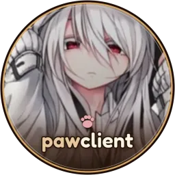
  </a>

> _The custom osu! client for the [Pawtoka](https://pawinput.xyz/) private server (pawinput.xyz), a cheat-permissive revival of osu!atoka. A standalone, modified 2016 osu! build by [miracle](https://github.com/SimplyAe) (also the developer of [paw!cheats](#paw-cheats)) that connects only to Pawtoka, so Aspire maps may misbehave._

- **Status:** Active · Free · Standalone · Pawtoka client
- **History Preview:** [fishy.moe/pawclient](https://fishy.moe/client-cheating-archive#pawclient)
- **Maintainer:** <a href="https://github.com/SimplyAe"> miracle</a> (developer of [paw!cheats](#paw-cheats) and the Pawtoka server, working on an upcoming ?????? cheat)
- **Download:** [fishy.moe/download/pawclient](https://fishy.moe/download/pawclient)
- **Discord:** [discord.gg/2Etdy8nnwY](https://discord.gg/2Etdy8nnwY)
- **Support:** [Tip miracle on PayPal](https://paypal.me/gxddessAe)
- **Cheats:**
  - Timewarp
  - Relax
  - Enlighten (HD only)
  - AR Changer
  - Misc visuals shared with [paw!cheats](#paw-cheats): Lazer notelock, long / tube trail, and circle fade-out

### [OSU!RISE](https://osurise.online/?ref=QCXBQ3ZH) - Kernel Software

  <a href="https://osurise.online/?ref=QCXBQ3ZH">
    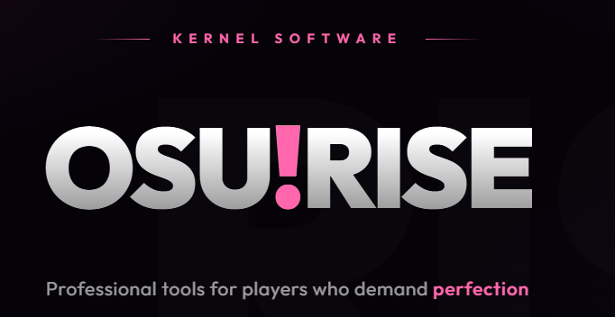
  </a>

> _Paid osu! cheat suite with aim assist, tap assist, Smart DKS, relax, and a replay/auto bot. Kernel Software also sells a separate cheat for Deadlock._

> [!WARNING]
>  **Community advisory from [Hugo (Xyrohh)](https://github.com/Xyrohh), [Kawata](https://kawata.pw) Co-Owner:** Careful with this one. The developers aren't really known in the community, so treat [OSU!RISE](https://osurise.online/?ref=QCXBQ3ZH) as **use-at-your-own-risk**: scan the loader yourself before you run it.

- **Status:** Active · Paid
- **Developers:** JoNjes and hello (Kernel Software Team)
- **Public release:** May 14, 2026
- **History Preview:** [fishy.moe/osu-rise](https://fishy.moe/client-cheating-archive#osu-rise)
- **Website/Download:** [osurise.online](https://osurise.online/?ref=QCXBQ3ZH)
- **Discord:** [discord.gg/bkcBf4jCmg](https://discord.gg/bkcBf4jCmg)
- **Showcase videos:** [Kernel Software showcase](https://www.youtube.com/watch?v=_lqZbx6c-bo) · [OSU!RISE startup guide](https://www.youtube.com/watch?v=y1N91Ef3JyI)
- **Cheats:**
  - Aim Assist: cursor guidance with adjustable strength, smoothing, and FOV
  - Tap Assist: corrects early clicks and mistimed taps
  - Smart DKS (Dynamic Key Strokes): works with any keyboard, engages automatically when needed
  - Relax: automated clicking with human-like randomization, configurable hold time and error margin
  - Enlighten: visual customization, change AR, change skins, toggle HD/FL removal
  - Replay Bot: replays any replay file 1:1
  - Auto Bot: full map automation with human-like, configurable playstyles
- **Notable tech:** Cloud-synced settings, stream-proof, advertised as zero FPS impact, and polymorphic per-user builds with encryption.

> [!NOTE]
>  **From [hinamizawa](https://github.com/alejandroatacho):** Full transparency from me: everything here was confirmed directly with the Kernel Software team through a Q&A. [OSU!RISE](https://osurise.online/?ref=QCXBQ3ZH) is a **paid, subscription-only loader**. You register on their site, then download the loader, so there's no static build for me to mirror or virus-scan, and no way for me to test it myself. Treat this as a documented summary from the developers, not a hands-on review.

> [!WARNING]
>  **Confirmed by [hinamizawa](https://github.com/alejandroatacho):** Timewarp is not included, despite similar cheats often bundling it, so do not expect it. **Only osu!standard is supported** right now; Taiko, Catch, and Mania are not.

## 

_Clients that are temporarily down for updates. Their information and cheats are preserved below, but they're currently unavailable to buy or use until the next build ships._

### Aeris - [Kawata](https://kawata.pw) 

  

  
  
  

> [!IMPORTANT]
>  **Noted by [hinamizawa](https://github.com/alejandroatacho):** **Aeris is hosted on fishy.moe.** The owner and maintainer, [TheFantasticLoki](https://github.com/TheFantasticLoki), is relocating to another area ✈️ , so the official download URL (`storage.kawata.pw`) is currently **offline**.
> **`storage.kawata.pw` has been down since June 2, 2026.**
> **fishy.moe has hosted Aeris since June 27, 2026,** while the official download stays offline, so it is fully available at [fishy.moe/download/aeris](https://fishy.moe/download/aeris).

<!-- -->

> _Active beta with modernized Skooter AC, Relax, Timewarp, and Aim Assist beta features._

- **Status:** Active (hosted on fishy.moe) · Official download offline (maintainer relocating) · Public beta · Free
- **History Preview:** [fishy.moe/kawata-aeris](https://fishy.moe/client-cheating-archive#kawata-aeris)
- **Maintainer:** <a href="https://github.com/alejandroatacho"> Hinamizawa</a> (current maintainer; <a href="https://github.com/TheFantasticLoki"> TheFantasticLoki</a>, retired developer; originally <a href="https://github.com/PANIGE"> Panini Céleste</a>; contributions from <a href="https://maple.software/"> Maple Syrup</a>, [Chewy/Pythr](https://github.com/Pytxhr) and <a href="https://github.com/nyoemii"> noemi</a>)
- **Download:**
  - **fishy.moe:** [fishy.moe/download/aeris](https://fishy.moe/download/aeris) *(hosted on fishy.moe)*
  - **Official:** [storage.kawata.pw](https://storage.kawata.pw/get/osu!Kawata.zip) *(currently offline, maintainer relocating)*
- **Discord:** [discord.gg/pu5zCBfMhZ](https://discord.gg/pu5zCBfMhZ)
- **Virus analysis:** [Hybrid Analysis report](https://www.hybrid-analysis.com/sample/3a08fea940bb7028b08b0a6688cae86344af3fc5ea2340ff03a29d95be090614)
- **Cheats:**
  - Aim Correction (improved Skooter AC, optional Tap-on-Correct for non-RX, relative range support)
  - Relax Hack (SkooterRX Improved)
  - Timewarp (rate & multiplier)
  - Automatic CS Changer · AR Changer · HD Remover · FL Remover
- **Beta features:**
  - Maple Aim Assist V1 + V2 (submitting); V3 and L-V1 not submitting
  - Dedicated input thread (aim only, 1/2/4/8/16K FPS options)
- **Dev features:**
  - Dev version has been updated to 64-bit and modern .NET 8.
  - Slightly better Windows integration for shortcuts and notifications.
  - Can run more stably and smoothly depending on the system.
  - Very experimental; performance is not guaranteed and depends on the system.

> [!TIP]
>  **Noted by [TheFantasticLoki](https://github.com/TheFantasticLoki):** Add the install folder as an antivirus exclusion to prevent issues.

> [!NOTE]
>  **Noted by [hinamizawa](https://github.com/alejandroatacho):** **Good news first: Aeris updates itself.** Every time you launch it, the client checks fishy.moe and quietly pulls only the files that changed, so a new build lands on its own. You never re-download or reinstall for a normal update.
>
> **Coming from an older Aeris and it will not start, or your maps will not load after you switch?** That is a one-time reset, not something you repeat. An old install can hold files that no longer match the current build, so clear them once and let the updater rebuild a clean set: close osu!Aeris, open your install folder (`%LocalAppData%\osu!Aeris\`), and delete the CLIENT files only: `osu!.exe` plus every `.dll` (and the other loose program files). **Do not touch your Songs (your maps), your scores, or your skins**, and you can leave the error and log text files alone. Relaunch with the osu!Aeris shortcut and the updater re-downloads the client fresh. After this one time, updates go back to being automatic.
>
> One heads-up so you do not panic: right after the relaunch your maps can briefly show as missing. They are not gone. Restart osu! once and they come back, and anything you deleted also lands in the Recycle Bin, so nothing is lost.

 

Per the [Kawata](https://kawata.pw) Discord `help` channel (fix documented by drown): if excluding the install folder still doesn't fix it, drag `libGLESv2.dll`, `Microsoft.Ink.dll`, `osu!.deps.json`, `osu!.dll`, `osu!.dll.config`, `osu!.exe`, `osu!.Game.dll`, `osu!.Resources.dll`, `osu!.runtimeconfig.json`, `osu!common.dll`, and `osu!common.dll.config` into `%LocalAppData%\osu!Aeris\`, and click **Skip** if it asks to replace 2 files.

  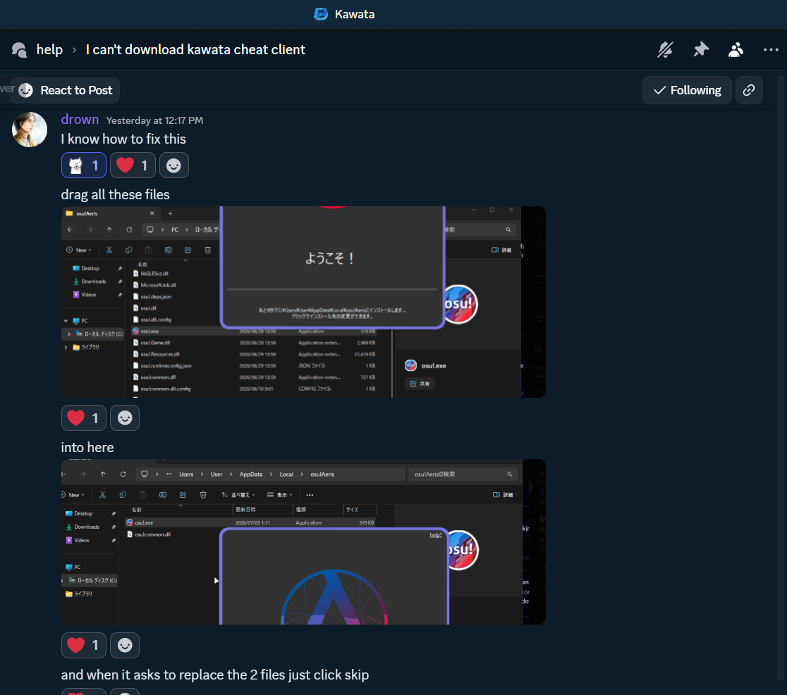

### Maple

  

  
  

> [!IMPORTANT]
>  **Tracked by [hinamizawa](https://github.com/alejandroatacho):** The Maple client is currently going through updates and is **unavailable to purchase or use** right now. It is only handed out to a selected few within their circle. The details below are preserved for reference and will apply again once the next build is officially released.
> **Under development since December 13, 2024 following a source-code leak (per the official Discord announcement).**

> _Paid hack with no built-in limits, actively maintained._

- **Status:** Under maintenance · Temporarily unavailable · Paid
- **History Preview:** [fishy.moe/maple](https://fishy.moe/client-cheating-archive#maple)
- **Maintainer:** Maple Syrup
- **Download:** <a href="https://maple.software/"> maple.software</a> *(temporarily unavailable)*
- **Discord:** [discord.gg/P9Yn8FfC2v](https://discord.com/invite/P9Yn8FfC2v)
- **Cheats:**
  - Aim Assist (3 versions)
  - Relax Hack
  - Tap Assist
  - Timewarp
  - AR Changer · CS Changer · HD Remover · FL Remover

> [!NOTE]
>   **Confirmed by [Hugo (Xyrohh)](https://github.com/Xyrohh) & [Rizky (ptrchain)](https://github.com/ptrchain):** One of the people behind the 2024 source-code leak mentioned above is a developer going by Cyw, also the developer of [Lycoris](#lycoris). Possibly one of several people involved, not necessarily the only source.

 

  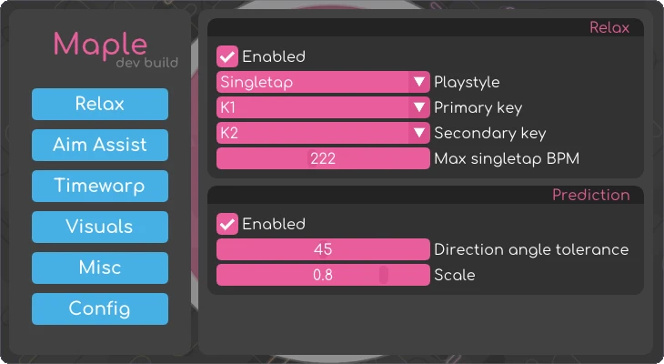
  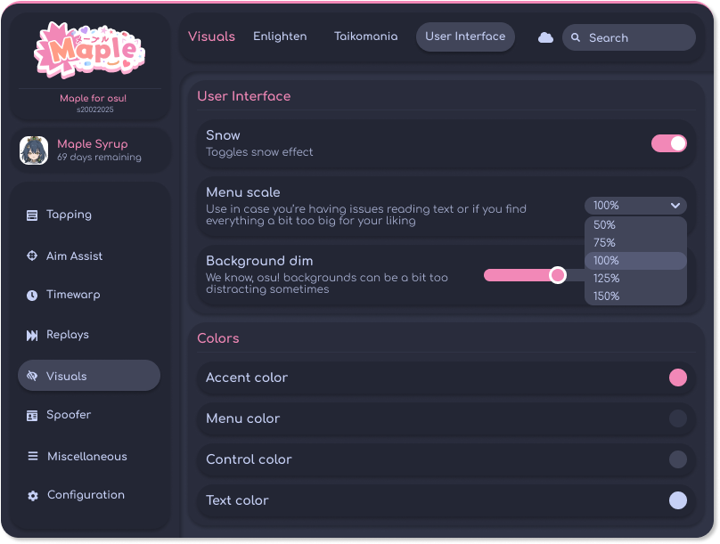
  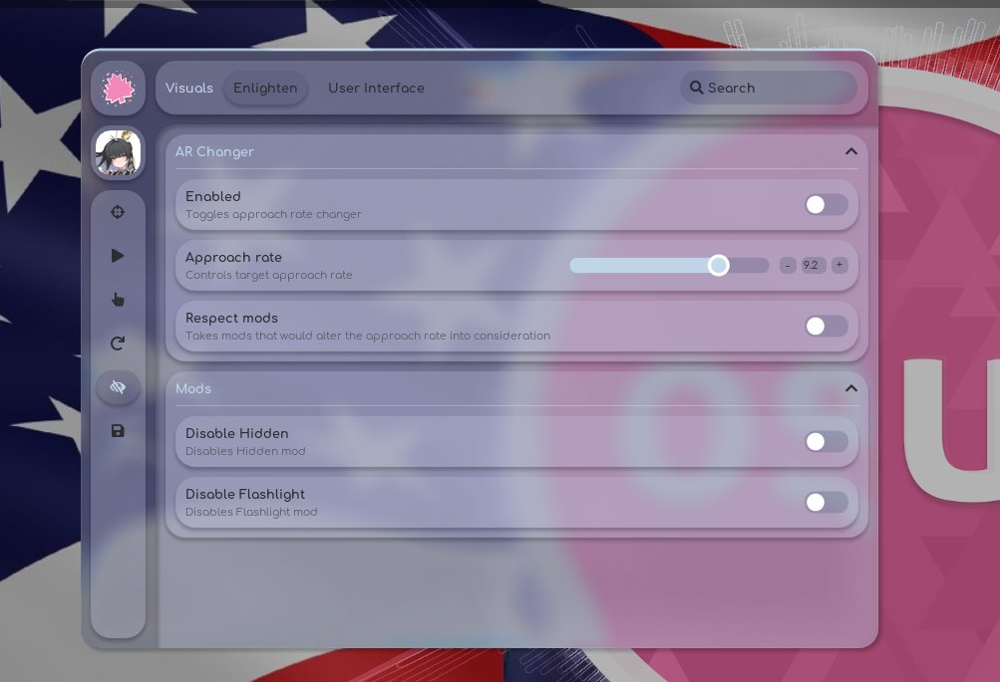
  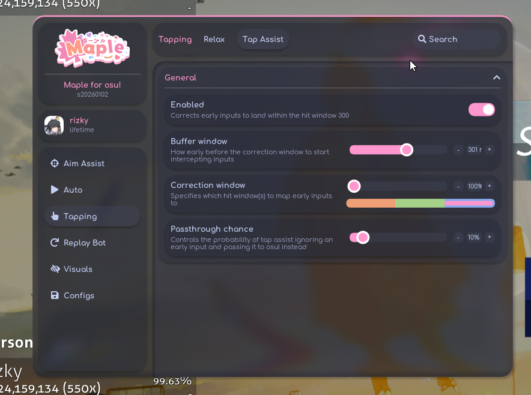
  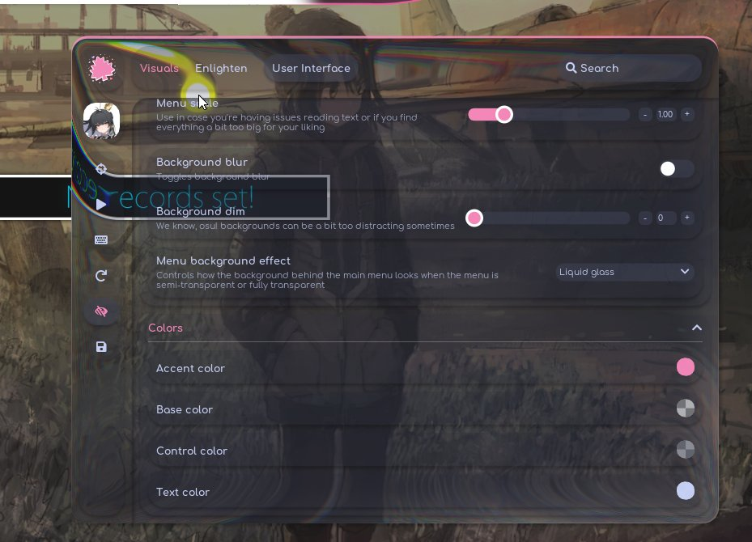
  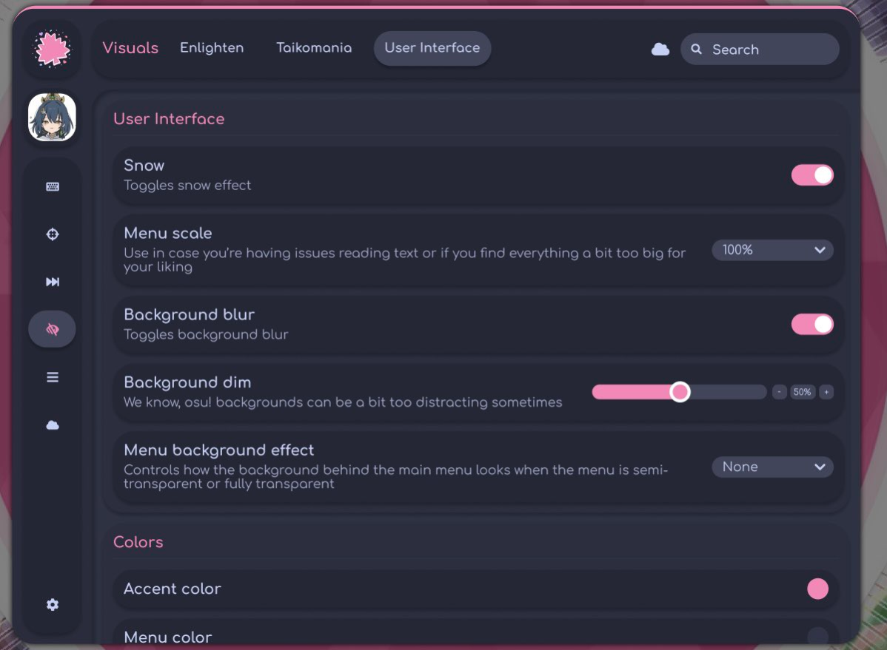
   The Maple dev build menu, User Interface, Enlighten AR Changer, Tap Assist, Visuals, and collapsed-sidebar screenshots, shared by <a href="https://github.com/ptrchain">Rizky</a>.

## 

_Upcoming clients that have been announced or previewed but are not released yet. Details and release dates can change._

> [!WARNING]
> Release dates are unknown and nothing is confirmed. Please do not bother or stress the developers about it.

### AQN Revived V3

  <a href="https://theaquila.network">
    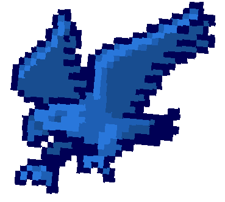
  </a>

> _A revival of AQN, in active development. Release date unknown._

- **Status:** Under development · Release date unknown
- **History Preview:** [fishy.moe/aqn-revived-v3](https://fishy.moe/client-cheating-archive#aqn-revived-v3)
- **Developer:** <a href="https://github.com/ptrchain"> ptrchain</a>
- **Website:** [theaquila.network](https://theaquila.network)
- **Discord:** [discord.gg/jkYzjHyqMg](https://discord.gg/jkYzjHyqMg)

 

  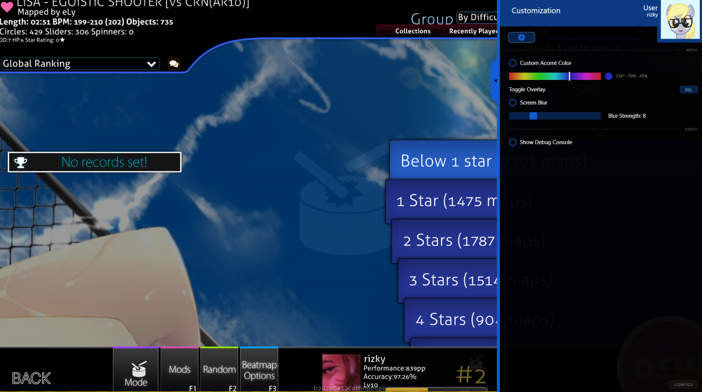
  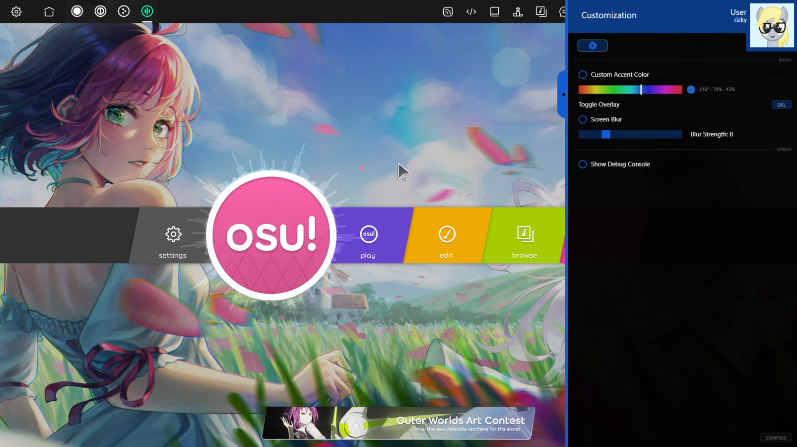

### ??????

> _An unannounced osu! client in early development. Name, feature set, and release date are all unknown._

- **Status:** Under development · Name and release date unknown
- **History Preview:** [fishy.moe/mystery-client](https://fishy.moe/client-cheating-archive#mystery-client)
- **Lead Developer/Owner:** <a href="https://github.com/SimplyAe"> miracle</a> (of <a href="#paw-cheats">paw!cheats</a>)
- **Assistant:** <a href="https://github.com/nyoemii"> noemi</a> (of <a href="#tuyosu">tuyosu</a>)

 

  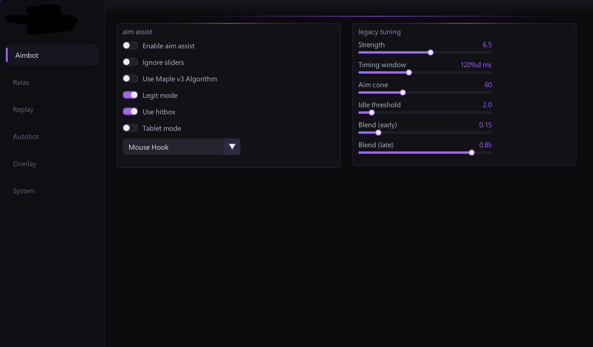
  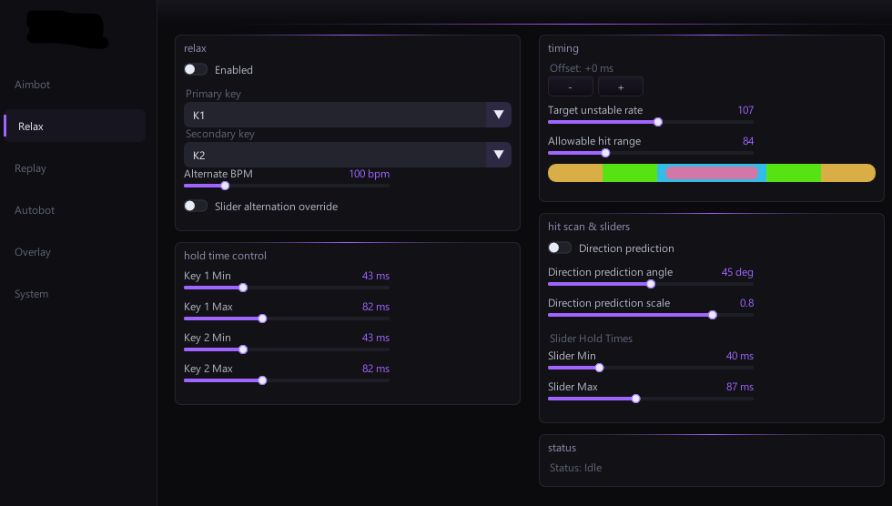
  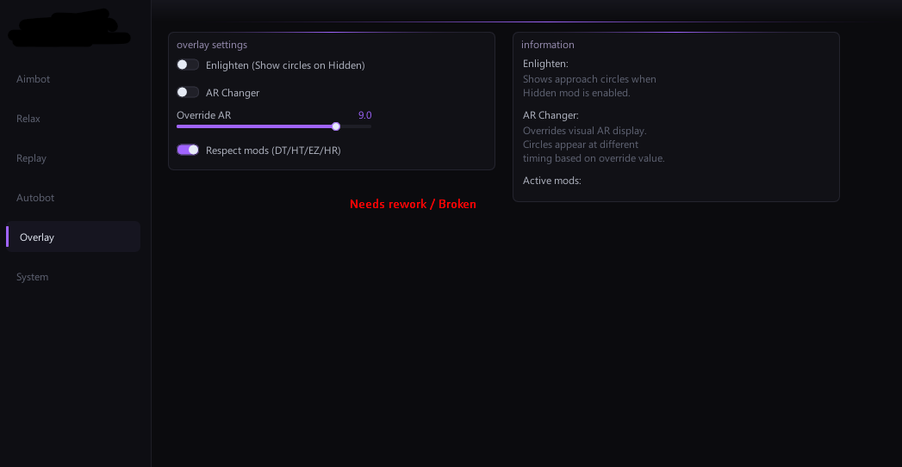

## 

_Discontinued or no-longer-maintained clients, kept here for historical reference. Most downloads will be broken or unsafe by now._

> [!WARNING]
>  **Extracted by fishy.moe research user agent:** Discord CDN links rot without notice. Verify the file hash or get a fresh copy from MPGH or the relevant Discord before running anything. Scan every binary yourself ([VirusTotal](https://www.virustotal.com/), [Hybrid Analysis](https://www.hybrid-analysis.com/)) before execution.

### AQN V0 + V1 + V2

  

> _AQN began in 2011 under lead developer Kevin. V0 sold its cheats separately; V1 introduced the unified loader and in-game sidebar AQN became known for. Rumoi continued the line as V2, most likely 2016 to 2017. Now free; crashes on the current osu! version._

- **Status:** Archived · Broken on current osu!
- **History Preview:** [fishy.moe/aqn](https://fishy.moe/client-cheating-archive#aqn)
- **Maintainer:**  Kevin (original developer, V0/V1, 2011; later V2 server maintainer, website name owner, and update rollout) and <a href="https://github.com/rumoi"> Rumoi</a> (V2 lead developer). Both unmaintained.
- **Download:**
  - [theaquila.net](https://theaquila.net/) *(legacy site, "The Aquila Network" brand)*
  - [github.com/rumoi/AQN_nologin](https://github.com/rumoi/AQN_nologin) *(no-login / free version)*
- **Cheats:**
  - Relax *(V0; upgraded again in V2)*
  - Auto Pilot *(V0)*
  - Enlighten *(V0)*
  - Timewarp *(V0; V2 adds an adjustable Play Speed slider, No Spectator Buffer, Show Approx Countdown, and an Indicator Scale option)*
  - Auto Taiko *(V0)*
  - CTB *(V0 beta)*: stable, no memory leaks, but discontinued once Relax and Timewarp became the top sellers
  - Replay Editor *(V2)*
  - Score Submission Preventor *(V2)*: a manual gate before a bot-played score submits, with configurable pass/accuracy/combo percentages, random spread, mod toggles, a randomized submit delay, and an auto-submit toggle
  - Aim Assist *(V2)*: released in several successive versions as competition intensified, first against Kat's standalone Aim Assist, then against [Auto Assist Megumi](#megumi)
  - VIP tier *(V2, by Rumoi)*: a paid tier with Free Supporter, Hide Button On Close, and Extra Skinables, plus a far deeper Enlighten rebuild (legacy AR/Hidden modes, quality, cursor size, circle and AR thickness sliders, and color pickers)

> [!NOTE]
>  **The original team (2011):** Kevin was the solo lead developer. Ben made a minor but important contribution to V0's early stages, before unexpectedly passing away in real life. Hinamizawa and "Bikko" moderated the community (this Bikko is unrelated to the touchscreen-cheat "Bikko" and its 2012 to 2013 controversy; a different person who happens to share the handle, and nationality). V0 arrived in an era when cheats were sold and run separately; V1 unified them behind the loader and sidebar.

> [!NOTE]
>  **The V2 team (start year unknown, most likely 2016 to 2017):** Rumoi took over as lead developer. Kevin stayed on as server maintainer and website name owner, handling update rollouts; Helsing moderated the Discord; Hinamizawa wrote guides and managed the forum. Rumoi released a replay editor, upgraded Relax, and pushed out several successive Aim Assist versions as the competition intensified, putting AQN in direct competition, first with Kat's standalone Aim Assist, then with [Auto Assist Megumi](#megumi) (Kat's upgraded version, built with other contributors).

> [!NOTE]
>  **The Taiko/CTB bug:** During the transition from V1 to V2, an Enlighten update by Rumoi broke Taiko rendering. For reasons unknown, nearly every cheat client that followed inherited the same Taiko bug, and a similarly odd CTB bug, except [Ainu](#ainu). A later alternative fix attempt helped, but never fully resolved it.

 

  
  
<em>AQN's original 2012 eagle logo, matching the "Aquila" (Latin for eagle) name.</em>

  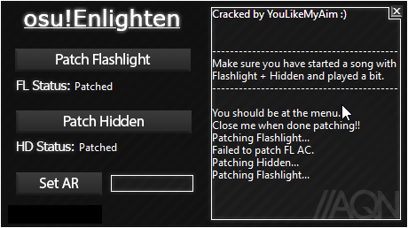
  
<em>AQN V0's standalone Enlighten tool (Flashlight/Hidden patcher), cracked by YouLikeMyAim.</em>

  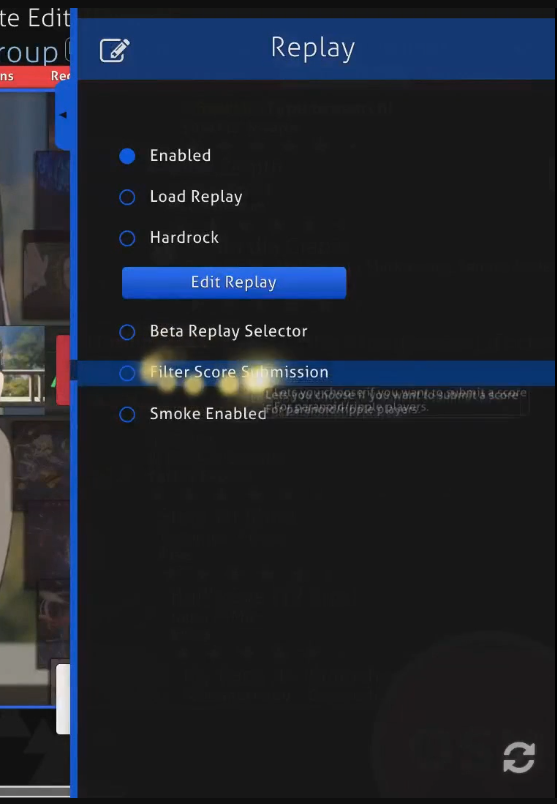
  
<em>AQN V1's in-game sidebar: the Replay panel (Load Replay, Hardrock, Edit Replay, Beta Replay Selector, Filter Score Submission), with beatmap covers along the left edge.</em>

  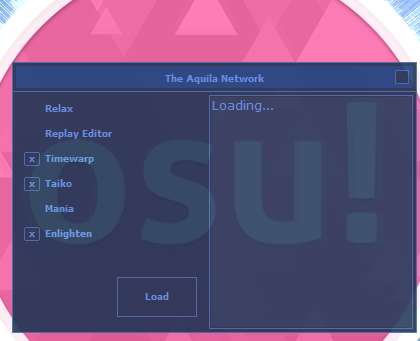
  
<em>The Aquila Network loader, mid-transition between V1 and V2: module checkboxes for Relax, Replay Editor, Timewarp, Taiko, Mania, and Enlighten.</em>

  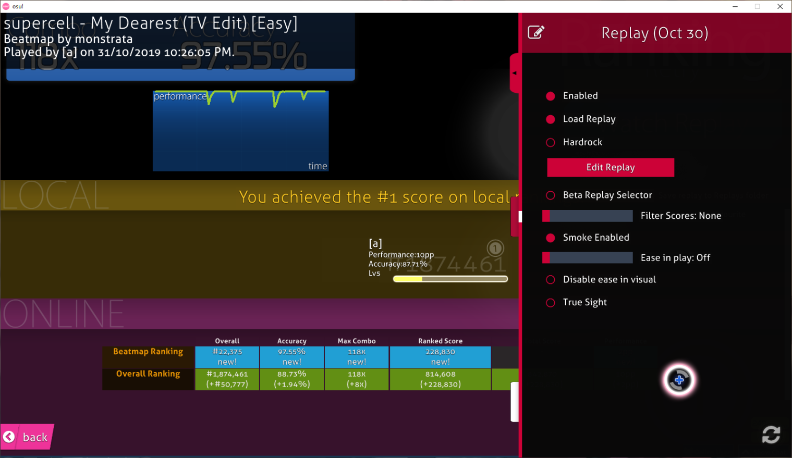
  
<em>An early V2 Replay Editor design (October 2019): Load Replay, Hardrock, Beta Replay Selector, Filter Scores, Smoke Enabled, Ease in play, Disable ease in visual, and True Sight.</em>

  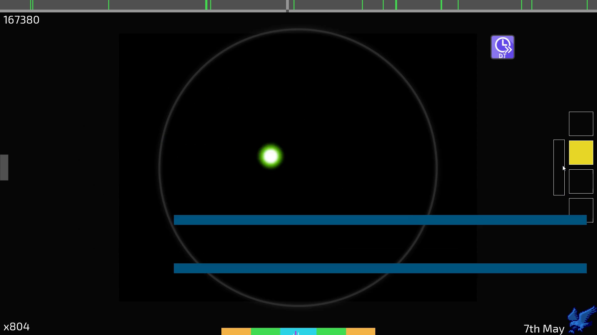
  
<em>A frame from an early working demo of Rumoi's Replay Editor, scrubbing frame by frame through a DoubleTime play.</em>

  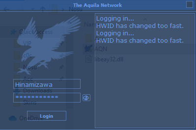
  
<em>The Aquila Network's HWID rate-limit check ("HWID has changed too fast"), logging into Hinamizawa's own account.</em>

  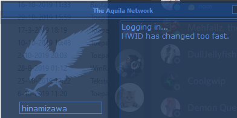
  
<em>The same HWID protection catching Hinamizawa's own login history.</em>

  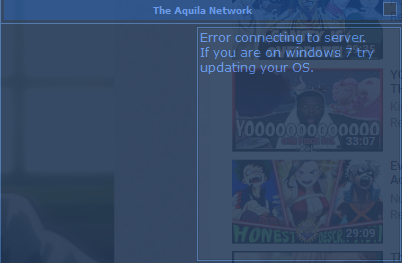
  
<em>A Windows 7 connectivity error message, with the loader's built-in music player showing in the background.</em>

  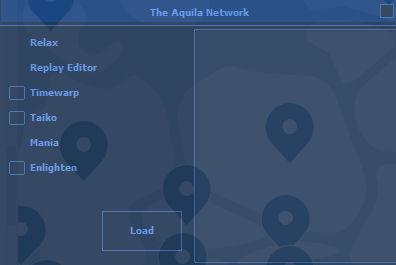
  
<em>Another Aquila Network loader skin, with a map-pin themed background.</em>

  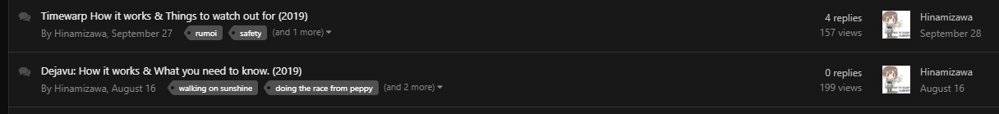
  
<em>Two of Hinamizawa's eleven AQN forum guides: "Timewarp: How it works & things to watch out for" and "Dejavu: How it works & what you need to know" (both 2019).</em>

  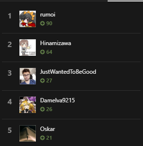
  
<em>The AQN forum's top contributors by reputation: rumoi, Hinamizawa, and others in the community.</em>

  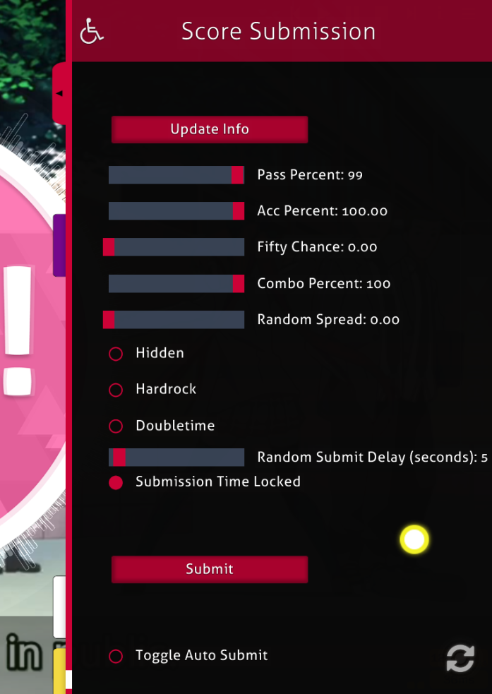
  
<em>AQN V2's Score Submission panel: pass/accuracy/combo percentages, random spread, mod toggles, a randomized submit delay, and an auto-submit toggle.</em>

  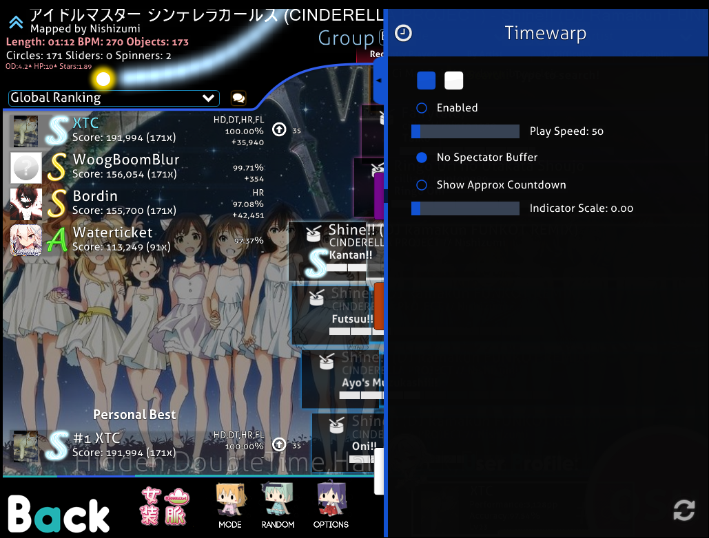
  
<em>AQN V2's Timewarp panel: Enabled, Play Speed, No Spectator Buffer, Show Approx Countdown, and Indicator Scale.</em>

  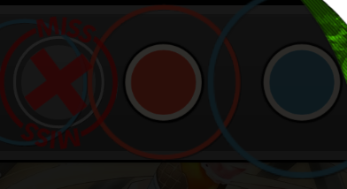
  
<em>The Taiko rendering bug that followed Rumoi's Enlighten update, later inherited by nearly every future cheat client except [Ainu](#ainu).</em>

  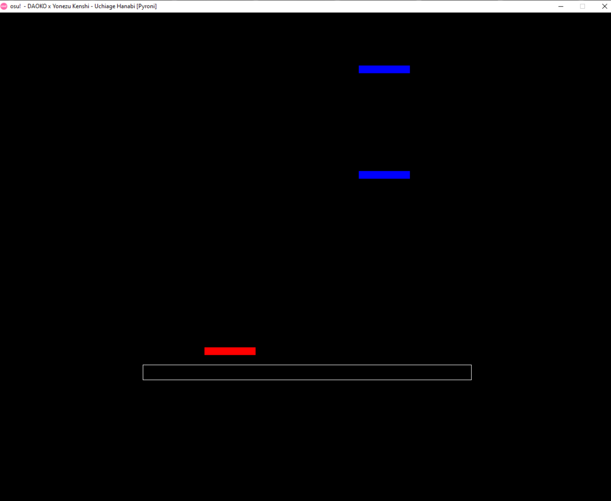
  
<em>A later alternative fix attempt for Enlighten's Taiko rendering. Not the fix everyone wanted, but it helped.</em>

  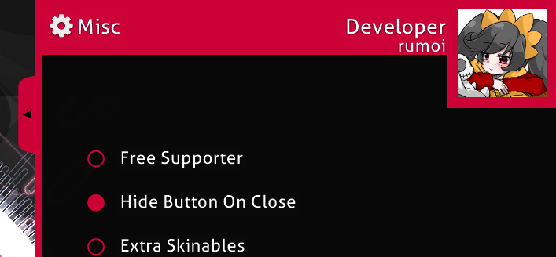
  
<em>The Rumoi-developed VIP tier's Misc panel: Free Supporter, Hide Button On Close, and Extra Skinables.</em>

  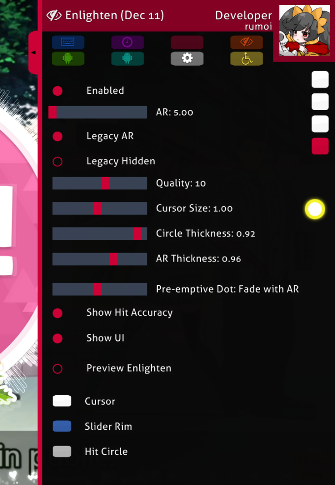
  
<em>The VIP tier's rebuilt Enlighten (Dec 11): legacy AR/Hidden modes, quality, cursor size, circle and AR thickness, and color pickers for cursor, slider rim, and hit circle.</em>

  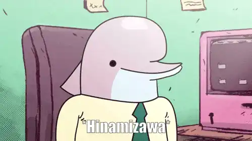
  
<em>A promotional GIF Hinamizawa made himself for a V2 lifetime-subscription sale.</em>

### freedom

  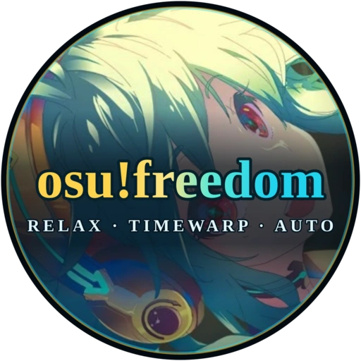

> _DLL-injected osu! cheat by Ciremun, originally posted on UnKnoWnCheaTs in 2023. The GitHub repo is offline; both builds are mirrored on fishy.moe._

> [!NOTE]
>  **From [hinamizawa](https://github.com/alejandroatacho):** One of the most widely shared free osu! cheats. It still circulates on cheat forums years after its repo went offline, and across the private servers I have moderated over the years it is the cheat I have seen come up the most in player reports and ban appeals. So I gave this abandoned, forgotten cheat its own logo and dedication here. Grab it only from a scanned source such as the fishy.moe mirrors below.

- **Status:** Archived · Unmaintained · GitHub offline
- **Version:** 0.94.3 (last release May 17, 2024)
- **Maintainer:** [Ciremun](https://github.com/Ciremun) (creator · account/repo offline · unmaintained), [hel1ngx](https://github.com/hel1ngx) (current v0.98 fork, the build hosted on fishy.moe); contributions from [Maple Syrup](https://maple.software/) and MrFlashStudio
- **History Preview:** [fishy.moe/freedom-memorial](https://fishy.moe/client-cheating-archive#freedom)
- **Source (open source):** Ciremun's repo is offline, but the C source survives in community mirrors:
  - [free-osu/free-osu](https://github.com/free-osu/free-osu) *(v0.94.3, matches the last release)*
  - [hel1ngx/OSU-FREEDOM](https://github.com/hel1ngx/OSU-FREEDOM) *(later v0.98 fork)*
- **Download (fishy.moe mirror, current):**
  - [fishy.moe/download/freedom-0-98](https://fishy.moe/download/freedom-0-98) *(v0.98, newest, self-injecting exe)*
  - [fishy.moe/download/freedom-0-94-3](https://fishy.moe/download/freedom-0-94-3) *(v0.94.3, legacy, DLL + injector)*
- **Download (legacy):**
  - [UnKnoWnCheaTs attachment](https://www.unknowncheats.me/forum/downloads.php?do=file&id=41014) *(legacy forum mirror)*
  - [github.com/Ciremun/freedom](https://github.com/Ciremun/freedom) *(original repo, offline)*
- **Source thread:**
  - [UnKnoWnCheaTs: osu! hack](https://www.unknowncheats.me/forum/other-games/588133-osu-hack.html)
  - [cheater.fun: osu freedom hack](https://cheater.fun/other-hacks-games/7886-osu-freedom-hack.html) *(legacy build listing)*
- **Format:** DLL. Ships with its own injector (v0.98 self-injects; v0.94.3 bundles `freedom_injector.exe`). Any injector like [Extreme Injector](https://fishy.moe/download/extreme-injector) also works.
- **Cheats:**
  - Aimbot
  - Relax Hack
  - Timewarp
  - Replay
  - Mods (Unmod Flashlight, Score Multiplier)
  - Misc
- **How to use:**
  - Run the bundled Launcher, or inject the DLL with any working injector
  - **Right Click** the map title in-game to open Settings
  - **F11** to hide or show the mod menu

> [!NOTE]
> freedom comes with its own injector, so you don't need a separate one. The newest v0.98 build is a single self-injecting `freedom.exe` (just run it); the older v0.94.3 ships `freedom_injector.exe` next to the DLL. Any injector like [Extreme Injector](https://fishy.moe/download/extreme-injector) works too, as a fallback or for other DLL cheats.

> [!WARNING]
>  **Extracted by fishy.moe research user agent:** Ciremun's original GitHub repo is offline. Because freedom is open source, prefer building from the [free-osu](https://github.com/free-osu/free-osu) mirror, or verify any forum DLL against a known-good build. DLLs reposted on cheat forums frequently carry tampered builds, so scan every binary yourself ([VirusTotal](https://www.virustotal.com/), [Hybrid Analysis](https://www.hybrid-analysis.com/)) before injecting.

 

  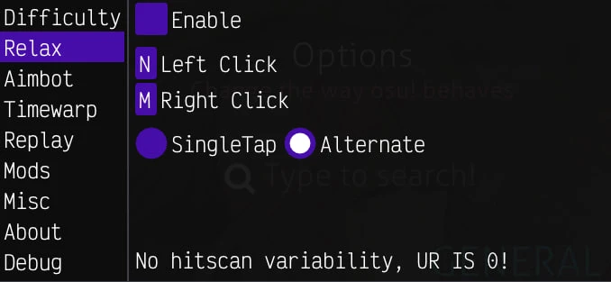
  
<em>The in-game overlay: Relax config (SingleTap / Alternate, UR forced to 0).</em>

  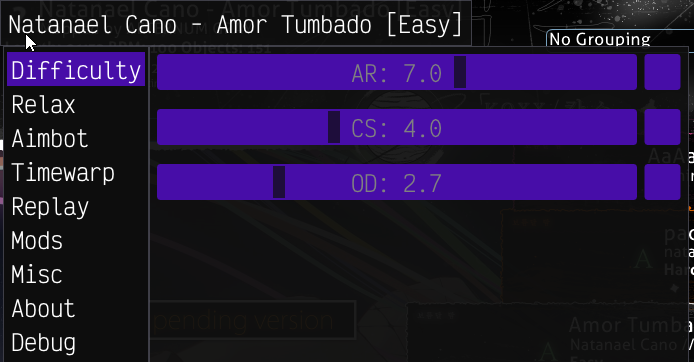
  
<em>The Difficulty tab: live AR / CS / OD override sliders.</em>

  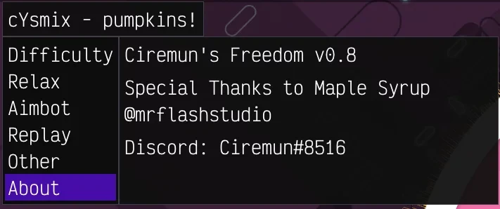
  
<em>The About tab: Ciremun's Freedom v0.8, thanks to Maple Syrup and MrFlashStudio.</em>

  
  
<em>The osu!freedom badge, the first logo this abandoned cheat ever had.</em>

### Ainu

> _Predecessor to [Skooter](#skooter) and [Abypass](#abypass). No longer maintained._

- **Status:** Archived · Unmaintained
- **History Preview:** [fishy.moe/ainu](https://fishy.moe/client-cheating-archive#ainu)
- **Maintainer:** Cherry/Aoba Suzukaze (edits by [Chewy/Pythr](https://github.com/Pytxhr); unmaintained)
- **Download:** An original copy was found. It's currently being tested and verified, with a new design card in the works, before it releases back to the public on fishy.moe.
- **Download (legacy):**
  - [Main link](https://cdn.discordapp.com/attachments/827128975897657344/889117178744434738/ainu-cheat.exe) *(Discord CDN, dead)*
  - [Alternate version](https://cdn.discordapp.com/attachments/837034085478039574/902318926980071434/ainu-cheat_1.exe) *(Discord CDN, dead)*
- **Source thread:** [MPGH: osu! Ainu Cheat Client](https://www.mpgh.net/forum/thread/1484323-osu-ainu-cheat-client) *(official thread, closed January 1, 2020)*
- **Cheats:**
  - osu!direct
  - Perfect ReplayCopy
  - Timewarp
  - Normal AR for EZ
  - Fake Hidden
  - Fake Flashlight
  - AR Changer
  - Disable Score Submission
  - Prefer "original" osu! Discord RPC (Ainu client has its own RPC)
  - Nameprotect (changes your name locally for the client and for the RPC)
  - Custom Rank (same thing, for your rank)
  - Relax
  - Save Me
  - Multiaccount Mode
  - Spoof MAC Address
  - Spoof Disk Signature
  - Spoof Uninstall ID

> [!NOTE]
>   **Rumors (provided by [noemi (nyoemii)](https://github.com/nyoemii) & [miracle (SimplyAe)](https://github.com/SimplyAe)):** Ainu builds are reportedly still circulating, with some claiming to hold the original source and allegedly using AI to produce new versions. This is unconfirmed rumor and speculation only: the source appears lost to time and/or kept private by Cherry/Aoba Suzukaze, and Chewy/Pythr has deleted his GitHub account.

> [!NOTE]
>  **From [hinamizawa](https://github.com/alejandroatacho):** We also picked up a very unique Ainu build of our own for the archive, with noticeably different design work compared to the copy above. It's different enough that it could mean a third person out there holds some version of Cherry's original source, though that's unconfirmed and purely a rumor for now. Call it Ainu Enhanced: currently kept internal while we verify and test it, so there's no download yet.

 

  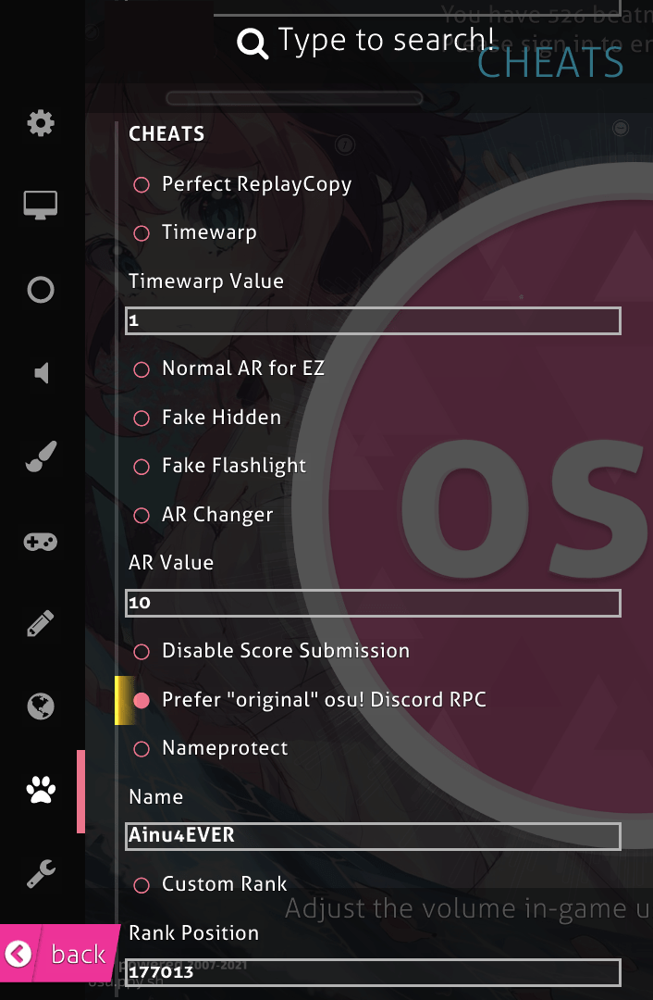
  
<em>Cheats menu: Perfect ReplayCopy, Timewarp, Normal AR for EZ, Fake Hidden/Flashlight, AR Changer, Disable Score Submission, the Discord RPC toggle, Nameprotect, and Custom Rank.</em>

  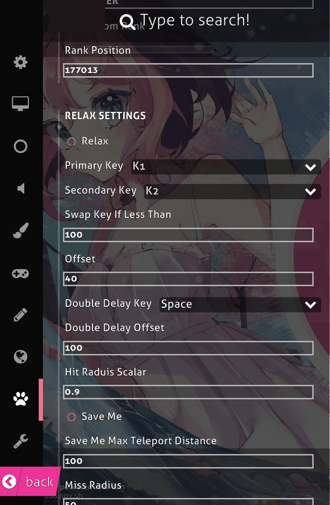
  
<em>Relax Settings: primary/secondary key bindings, swap and double-delay offsets, hit radius scalar, and the Save Me auto-teleport failsafe.</em>

  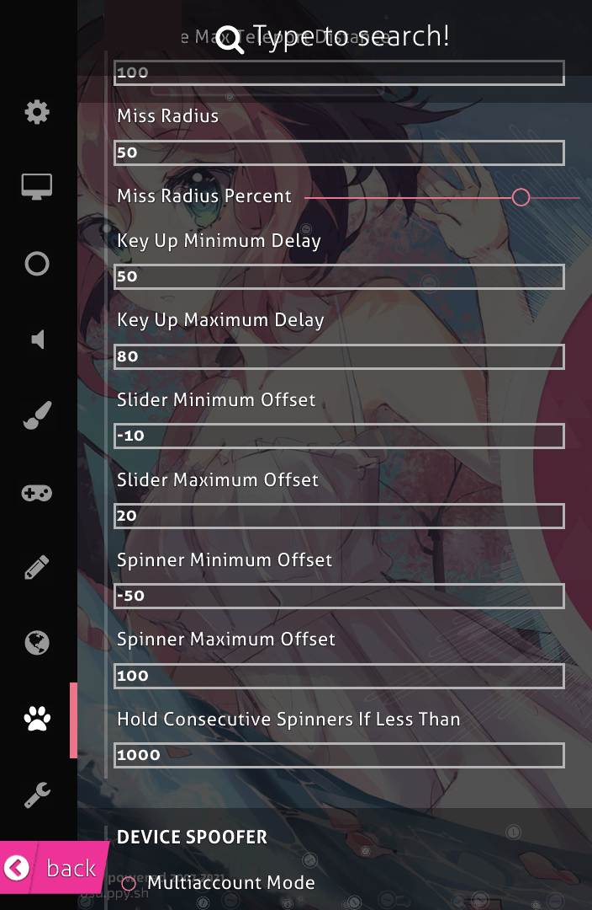
  
<em>More Relax tuning (miss radius, key-up delay, slider and spinner offsets) leading into the Device Spoofer section.</em>

  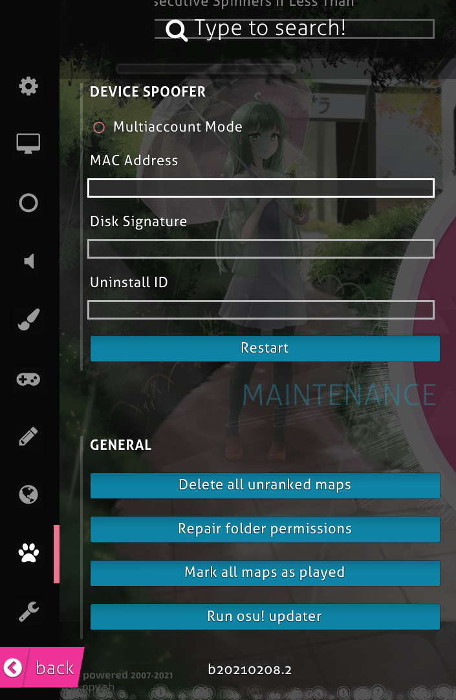
  
<em>Device Spoofer: MAC address, disk signature, and uninstall ID fields, plus General maintenance tools.</em>

  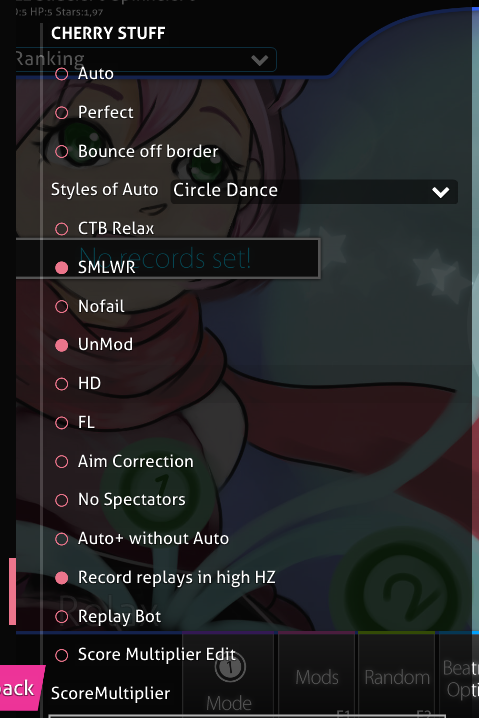
  
<em>The "Cherry Stuff" cheats menu: Auto/Perfect/Bounce-off-border modes, CTB Relax, SMLWR, UnMod, HD/FL removers, Aim Correction, and a Replay Bot toggle.</em>

  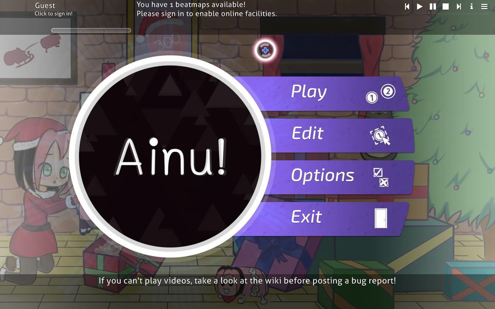
  
<em>The Ainu! main menu, running a custom holiday-themed skin.</em>

### Auto Assist Megumi

  

> _DLL-injected relax and aim assist cheat from the [osu!rx](#osu-rx) era. Rivaled [AQN V2](#aqn), a premium paid cheat, and some considered it even better. Originally built in C++ by kat, eee, and Cherry._

- **Status:** Archived · Free · DLL inject · Testing
- **History Preview:** [fishy.moe/megumi](https://fishy.moe/client-cheating-archive#megumi)
- **Maintainer:** kat, eee, and Cherry (original developers)
- **Website:** [megumi.dev](https://megumi.dev/) *(the real, still-active official site, owned and maintained by czapek)*
- **Download:** No public build is distributed. The original C++ source and forum threads are gone; a recovered build is in private testing (see below).
- **Cheats:**
  - Aim Assist: teleports the cursor near the circle, then teleports it back to its original position
  - Timewarp: slows down the game
  - HD and FL Remover: turns the HD and FL visual effects off without disabling the mod flag
  - AR and OD Changer: changes the AR and OD values
  - Replay Bot: mimics a given player's replay by loading that replay's `.osz` file
  - Relax hack: automated clicking

> [!NOTE]
>  **Noted by [hinamizawa](https://github.com/alejandroatacho):** Kat was one of the era's best known and most communicative cheat developers, active in the [Kawata](https://kawata.pw) community alongside co-developers eee and Cherry. Auto Assist Megumi's original C++ codebase, its downloads, and its forum threads are all lost to time. As a DLL-injected tool from the same era as [osu!rx](#osu-rx), it likely also needed the patched b20220424 build to run, though this is unconfirmed.

<!-- -->

> [!CAUTION]
>  **Flagged by [cbKocham (kird3333d)](https://github.com/kird3333d):** The only known revival attempt was a Python recreation on GitHub. It was reported to bundle a separate script that deletes the user's osu! install. We could not verify this ourselves, but out of caution we have removed the link and do not recommend running it. It never faithfully reproduced the original and was not considered viable.

<!-- -->

> [!NOTE]
>  **Provided by [cbKocham (kird3333d)](https://github.com/kird3333d):** A final build from Kat's team has since been recovered and handed over for backup, archival, and testing purposes. It is kept privately for now, pending safety verification, and is not currently available for public download.

<!-- -->

> [!NOTE]
>  **Provided by kaury:** A second build, referred to as `megumi_osu.dll`, came up separately during outreach: its holder described it as a Discord-only copy distinct from the archived `megumi_final.dll` above (which Kat's team released to a handful of forums), and shared two screenshots of its aim assist panel showing an `advanced mode` toggle and an `algorithm` control the archived build's menu doesn't have, in place of the archived build's `lock to center` option. The `algorithm` control isn't a single fixed option: the two captures show it switched between at least `controlled` and `gravity` modes, the latter swapping in its own assist speed and assist range sliders. Per the same holder, this aim assist panel is believed to be the only difference between the two builds; everything else (relax, difficulty, replays, scripts, config) is presumed identical.

<!-- -->

> [!NOTE]
>  **Noted by [hinamizawa](https://github.com/alejandroatacho):** Update: both hash-verified builds, `megumi_final.dll` and `megumi_osu.dll`, have now been retrieved and archived. Both are secured for preservation before any re-release.

<!-- -->

> [!NOTE]
>  **Provided by kaury:** A third menu capture has since surfaced, from a developer build of the client. Its title bar reads `megumi.dev`, its active user is "developer", and it is dated October 2022. It carries two tabs the earlier captures don't, "rewrite" and "misc", plus a "debug overlay" toggle in the aim assist panel, so it looks like an internal, developer-facing build distinct from the released menus above. See the "Developer build" gallery below.

 

  
  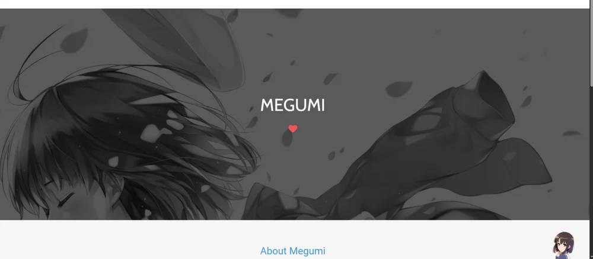
  
  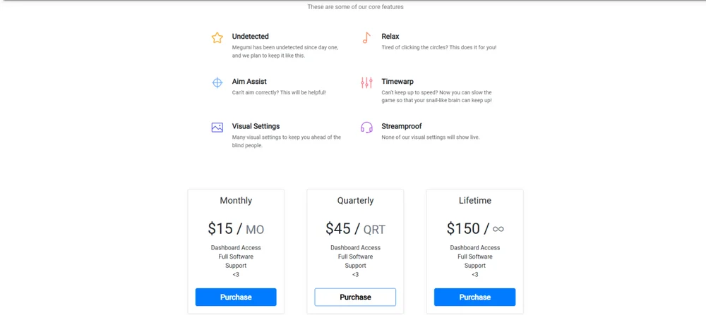
  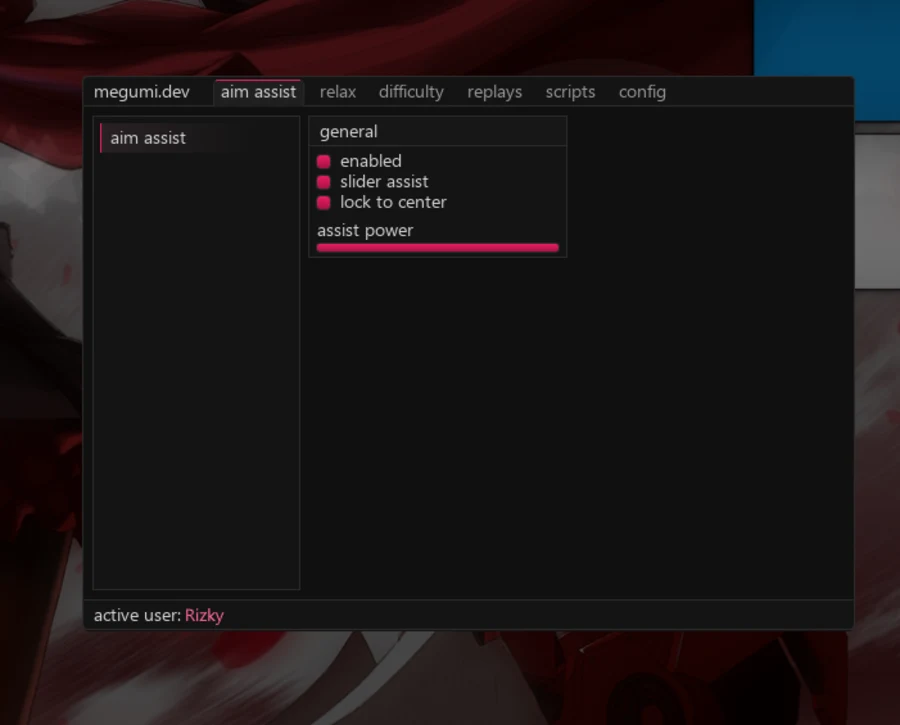
   megumi.dev's site image, hero, landing, features and pricing, and the client menu, shared by <a href="https://github.com/ptrchain">Rizky</a>.

 

  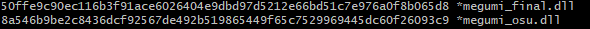
  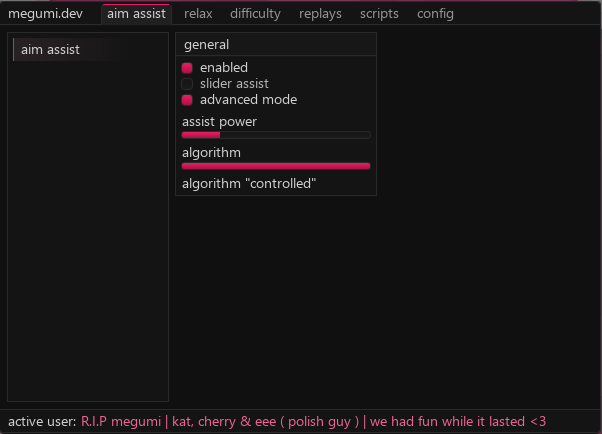
  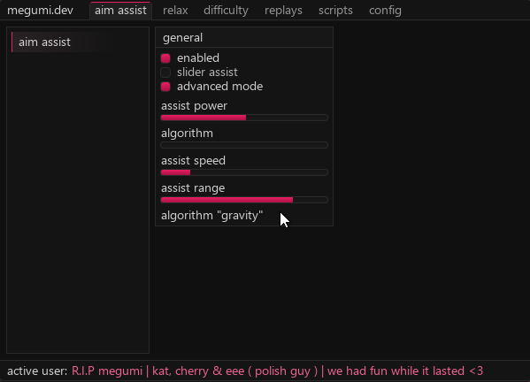
   A hash comparison naming both known builds, and the Discord-sourced build's aim assist panel with the algorithm set to <code>controlled</code> and then <code>gravity</code>. Its loader's status bar carries a farewell from the original team: "R.I.P megumi | kat, cherry &amp; eee (polish guy) | we had fun while it lasted &lt;3".

 

  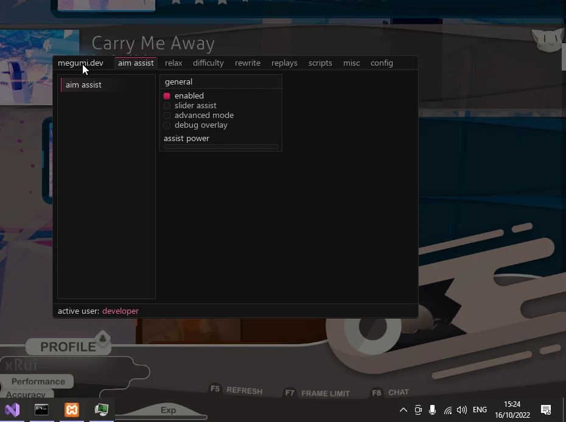
   A developer build of the megumi.dev client (active user "developer", dated 16 October 2022). Its tab bar adds "rewrite" and "misc" tabs the other captures don't show, and the aim assist panel carries a "debug overlay" toggle. Shared by kaury.

### Abypass

> _Successor to [Skoot.er](#skooter), mostly discontinued._

- **Status:** Archived · Unmaintained
- **History Preview:** [fishy.moe/abypass](https://fishy.moe/client-cheating-archive#abypass)
- **Maintainer:** [Chewy/Pythr](https://github.com/Pytxhr) (previously <a href="https://github.com/7ez"> Aochi</a>; unmaintained)
- **Download:** An original copy was found. It's currently being tested and verified before it releases back to the public on fishy.moe.
- **Download (legacy):**
  - [abypass.fumo.lol/updater](https://abypass.fumo.lol/updater) *(unverified)*
  - [cute.cat-girls.club mirror](https://cute.cat-girls.club/u/logytbz.zip)
- **Discord:** [discord.gg/RFj2839kbw](https://discord.gg/RFj2839kbw)
- **Cheats:**
  - Aim Correction
  - HD Remover
  - CTB Relax Hack (control catcher with mouse)
  - Automatic CS Changer
  - Relax Hack · Timewarp · AR Changer · FL Remover
- **Other features:** In-game PP counter · Built-in updater · Server switcher

### Skooter

> _Predecessor to [Abypass](#abypass). No longer maintained._

- **Status:** Archived · Unmaintained
- **History Preview:** [fishy.moe/skooter](https://fishy.moe/client-cheating-archive#skooter)
- **Maintainer:** Aoba Suzukaze, VacCat, [Chewy/Pythr](https://github.com/Pytxhr) (unmaintained)
- **Download:** An original copy was found. It's currently being tested and verified before it releases back to the public on fishy.moe.
- **Download (legacy):**
  - [skooter.shibe.lol](https://skooter.shibe.lol/) *(main link, archival)*
  - [Patched build](https://cdn.discordapp.com/attachments/598976475579809860/1082588578858680330/skooter_b5.exe) *(Discord CDN, for increased Aim Correction)*
  - [skooter_new](https://cdn.discordapp.com/attachments/883824772021108736/1083581690284359841/skooternew.zip) *(Discord CDN, if Skooter won't open)*

### tuyosu

  

> _Short-lived standalone osu! cheat by [noemi](https://github.com/nyoemii); never affiliated with [Kawata](https://kawata.pw). Released July 26, 2025, shut down June 5, 2026._

- **Status:** Archived · Discontinued (shut down June 5, 2026) · Free
- **History Preview:** [fishy.moe/tuyosu](https://fishy.moe/client-cheating-archive#tuyosu)
- **Lifespan:** July 26, 2025 to June 5, 2026 (~10 months)
- **Maintainer:** <a href="https://github.com/nyoemii"> noemi</a> (unmaintained)
- **Download:** [fishy.moe/download/tuyosu](https://fishy.moe/download/tuyosu)
- **Support:** [Tip noemi on Ko-fi](https://ko-fi.com/qwqnoemi)
- **Cheats:**
  - Aim Correction
  - Timewarp
  - CS Changer
  - AR Changer
  - FL Remover

> [!NOTE]
> Listed for archival completeness. The logo above was contributed by tuyosu's developer, [noemi](https://github.com/nyoemii), who reached out and gave permission to mirror the last worked-on version on fishy.moe, free to download and give away.

### paw!cheats

  

> _Short-lived, heavily-modified 2026 osu! client by [miracle](https://github.com/SimplyAe): a standalone, multi-mode cheat with humanized bots. Never publicly released but has pre-view images._

- **Status:** Archived · Discontinued · Standalone · Free
- **History Preview:** [fishy.moe/paw-cheats](https://fishy.moe/client-cheating-archive#paw-cheats)
- **Lifespan:** April 15 to May 18, 2026 (~1 month, per the developer's edit timestamps)
- **Maintainer:** <a href="https://github.com/SimplyAe"> miracle</a> (unmaintained)
- **Base:** A 2026 osu! client, heavily modified, with per-mode menus for osu! / Taiko / Catch / Mania.
- **Download:** Unavailable, never publicly released.
- **Cheats:**
  - Aim Assist V5: magnetic cursor pull (Strength, Base FOV, Humanization, Flow)
  - Aim Correction: tunable; works alongside Aim Assist
  - Human Autobot (osu!): humanized cursor movement (Aim Spread, Curve Strength); cursor-only, pair with Relax for clicks
  - Humanized auto-bots for Taiko & Mania: jack detection, fatigue, chord correlation, phantom releases, timing jitter
  - Click Assist / Relax: auto-clicks every object on time (score unranked); adjustable offset
  - Timewarp (with AR compensation) · AR Changer · CS Changer · HD Remover · FL Remover
  - Server switcher · hardware identity (HWID) profiles
- **Misc / visuals:**
  - Lazer notelock logic · insta-fade (keeps skin colors)
  - Long / tube trail (Danser-style rainbow trail; WIP, could crash) + trail length
  - Circle fade-out timing · DT/NC playback on a selected song

> [!NOTE]
> The **Catch (CTB) auto-bot was removed** before release ([miracle](https://github.com/SimplyAe) couldn't fix its memory leaks), so the Catch tab is wiped despite still appearing in the mode menu. Two builds appear in the screenshots. All details and images are developer-provided; paw!cheats was never publicly downloadable.

> [!IMPORTANT]
>  **Noted by [hinamizawa](https://github.com/alejandroatacho):** A compiled paw!cheats build was shared with fishy.moe, but we do not have the developer's permission to release it yet, so it stays archived (unreleased) for now while we wait on their final word.

 

  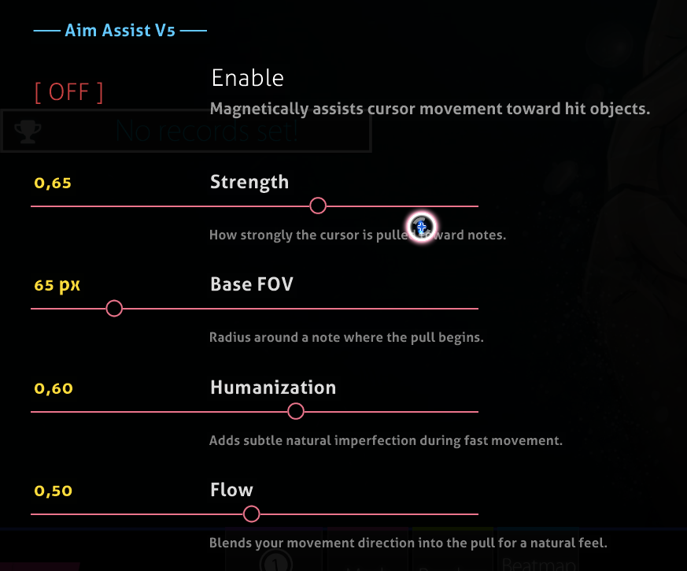
  
<em>Aim Assist V5: magnetic cursor pull, with Strength, Base FOV, Humanization and Flow.</em>

  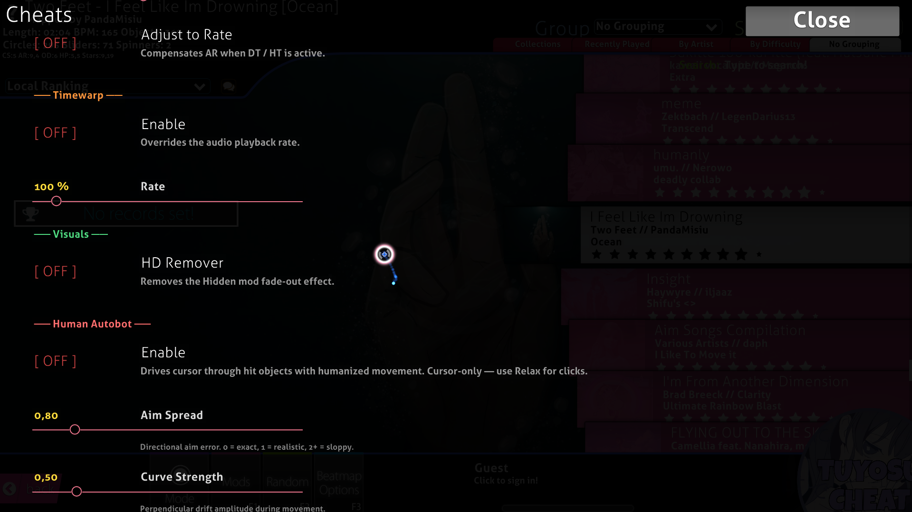
  
<em>Cheats menu: Timewarp, HD Remover, and the Human Autobot.</em>

  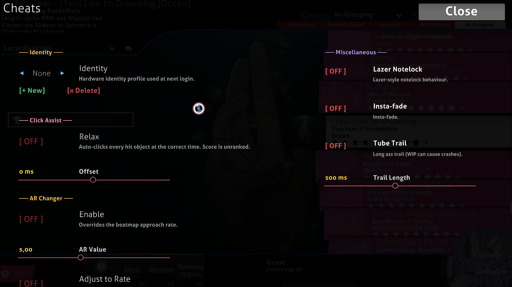
  
<em>Identity (HWID) profiles, Click Assist / Relax, AR Changer, and Miscellaneous (lazer notelock, insta-fade, tube trail).</em>

  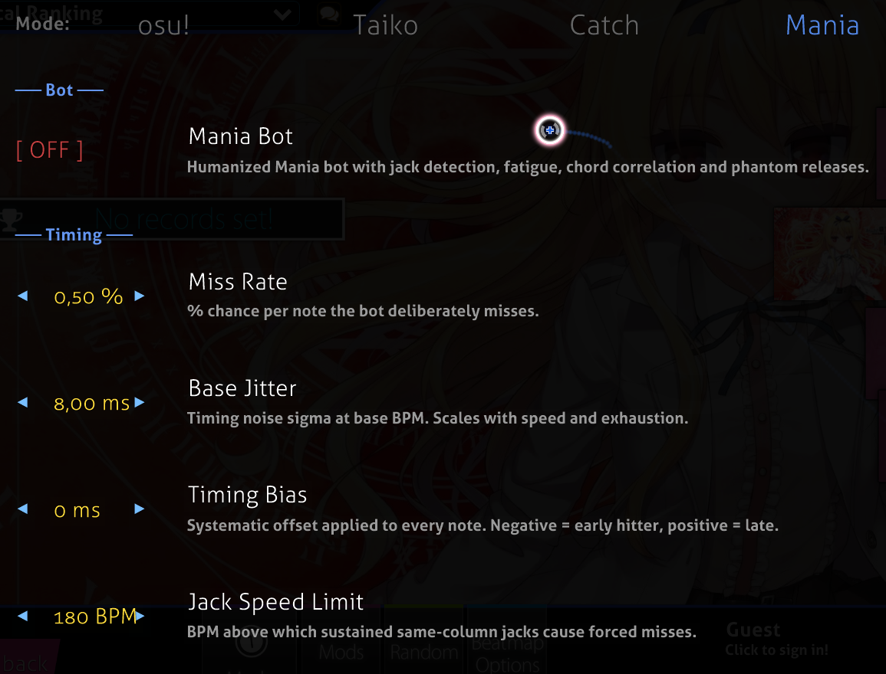
  
<em>Mania bot: jack detection, fatigue, chord correlation and phantom releases.</em>

  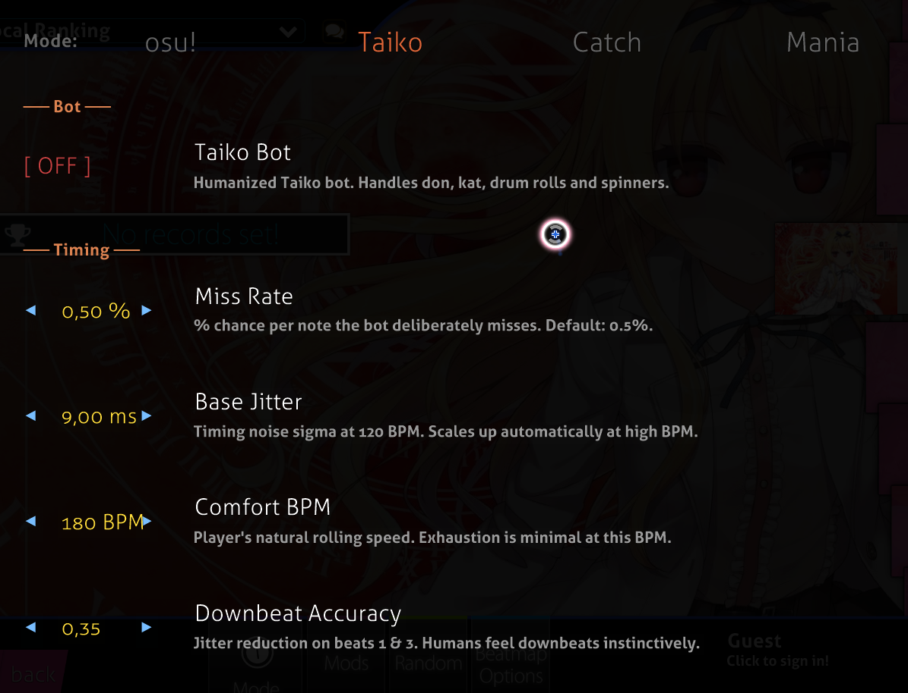
  
<em>Taiko bot: don/kat, drum rolls and spinners, with humanized timing.</em>

### Shaymi

> _A short-lived 2024 collaboration between [noemi](https://github.com/nyoemii) and [miracle](https://github.com/SimplyAe), from back when the two first met. No logo was ever made for it._

- **Status:** Archived · Unreleased · Free
- **History Preview:** [fishy.moe/shaymi](https://fishy.moe/client-cheating-archive#shaymi)
- **Maintainers:** <a href="https://github.com/nyoemii"> noemi</a> & <a href="https://github.com/SimplyAe"> miracle</a>
- **Download:** Unavailable. A compiled build is being preserved by fishy.moe, but we do not have the developers' permission to release it yet.

> [!IMPORTANT]
>  **Noted by [hinamizawa](https://github.com/alejandroatacho):** A compiled Shaymi build is being kept by fishy.moe, but we do not have the developers' permission to release it, so it stays archived (unreleased) here for now while we wait on their word.

### osu!rx

> _Relax and aim hack for the legacy osu! b20220424 build._

- **Status:** Archived · Free · Requires a patched osu! b20220424 build
- **History Preview:** [fishy.moe/osu-rx](https://fishy.moe/client-cheating-archive#osu-rx)
- **Maintainer:** Sasuke (originally mrflashstudio)
- **Download:** An original copy was found. It's currently being tested and verified before it releases back to the public on fishy.moe.
- **Download (legacy):** [MPGH thread](https://www.mpgh.net/forum/showthread.php?t=1538659) *(no direct link found; try the thread or the osu!rx Discord for a current source)*
- **Setup:**
  1. osu!rx does **not** run on the latest osu!. Download [b20220424](https://fishy.moe/download/osu-b20220424).
  2. Apply a TLS-patched `osu.exe` (see note below).
  3. Create a `_STAGING` file in your osu! folder to block auto-updates.

> [!NOTE]
>  **Extracted by fishy.moe research user agent:** The original Discord CDN mirror for the TLS-patched `osu.exe` is no longer reachable. Ask MPGH or the osu!rx Discord for a current source.

 

  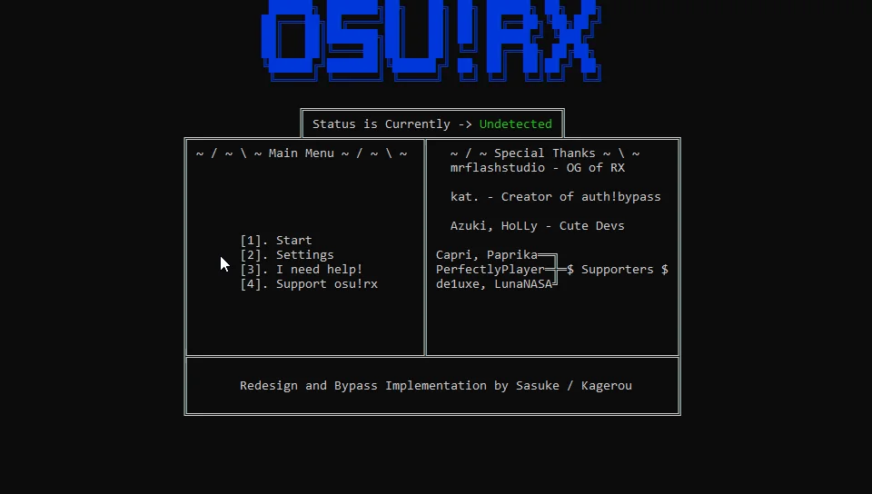
  
<em>osu!rx's console main menu: Start, Settings, and the special-thanks credits.</em>

  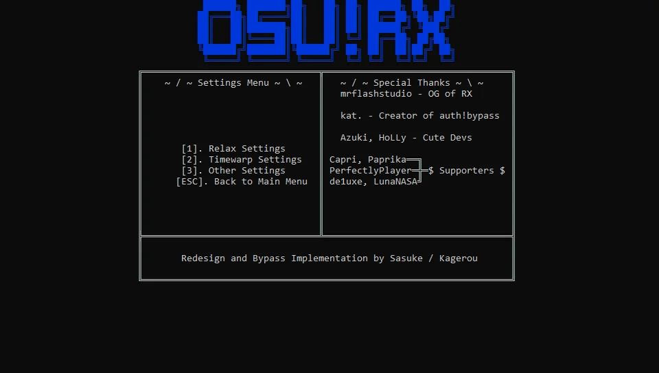
  
<em>The settings menu: Relax, Timewarp, and other tuning options.</em>

### OsuAuth

> _A very private, undocumented cheat from 2021 that never had a website or a proper loader. Its only known internal name was `asdf`._

- **Status:** Archived · No website · No public loader · 2021
- **History Preview:** [fishy.moe/osuauth](https://fishy.moe/client-cheating-archive#osuauth)
- **Type:** DLL inject
- **Maintainer:** Cherry (also co-developed [Auto Assist Megumi](#megumi))
- **Download:** Never had a public download, website, or loader. Preserved here through its two surviving screenshots.
- **Cheats:**
  - Aim Assist
  - Timewarp
  - Difficulty Changer
  - Replay Bot
  - Enlighten

> [!NOTE]
>  **Confirmed by [Rizky (ptrchain)](https://github.com/ptrchain):** Never had a real name. The only name visible anywhere in it is `asdf`, which looks like a placeholder someone typed while rushing to save a file, not an actual title. "OsuAuth" is a name coined for this archive entry so it has something searchable to go by. Confirmed to be built by Cherry: he did all of its updates, shared the files, and owned its Discord server.

 

  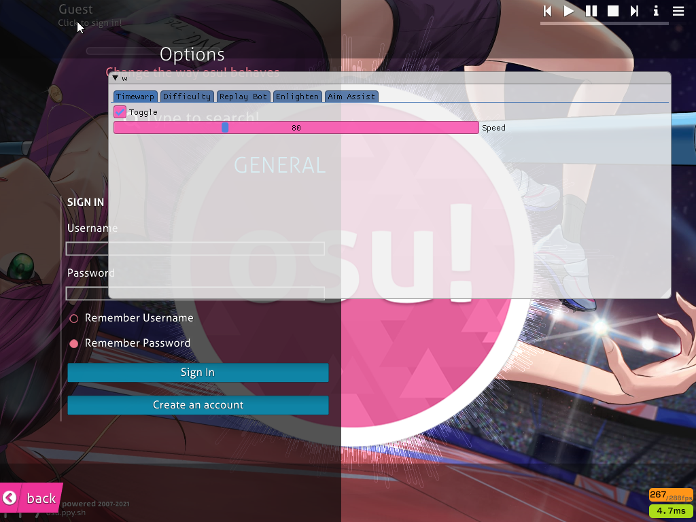
  
<em>One of two surviving screenshots: the settings overlay drawn directly over osu!'s own sign-in screen, mid-tab on Aim Assist (a toggle and a Speed slider). Shared by <a href="https://github.com/ptrchain">Rizky</a>.</em>

  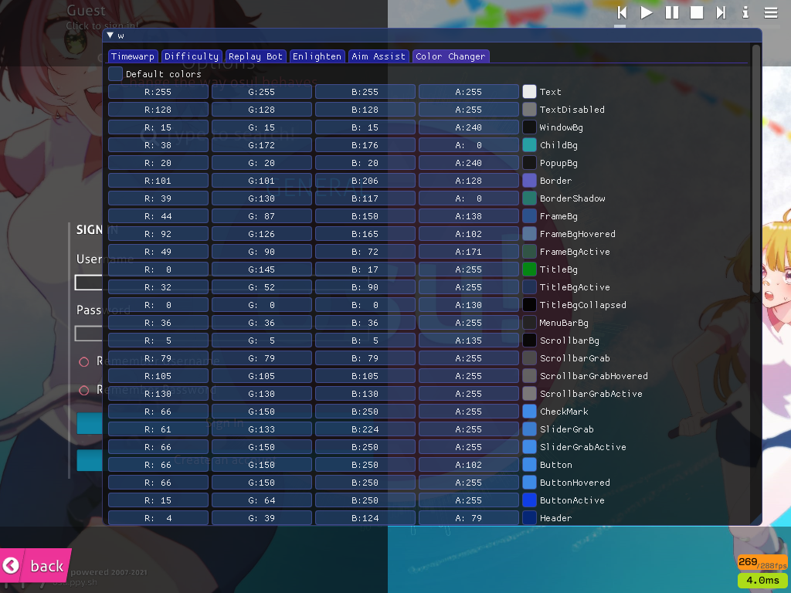
  
<em>The second shot, again over osu!'s sign-in screen: the Color Changer tab open, exposing the full tab set (Timewarp, Difficulty, Replay Bot, Enlighten, Aim Assist, Color Changer) and a per-element colour table. Shared by <a href="https://github.com/ptrchain">Rizky</a>.</em>

### Clarity

> _A short-lived 2022 osu! cheating forum and Discord, clarity.moe. Long thought lost, until a screen recording surfaced the live site, its Discord, and a board trading injectors, configs, and repackaged cheats like [Rumoi's AQN aim assist](#aqn)._

- **Status:** Archived · clarity.moe · Lost to time · Footage recovered
- **History Preview:** [fishy.moe/clarity](https://fishy.moe/client-cheating-archive#clarity)
- **Download:** Clarity had no client of its own: it was a hub that hosted and repackaged other people's tools. The forum and its Discord are long gone, and the clarity.moe domain now points at an unrelated cheat store (checked July 2026). A recovered screen recording is the only substantial record left.

> [!NOTE]
> The earliest surviving trace is one browser screenshot of a `clarity.moe` forum thread titled "rumoi's aqn aim assist aka spare cheat", posted July 23, 2022 by a user "Sentinel". It repackages [Rumoi's AQN aim assist](#aqn) disguised as a tablet driver process loaded through Discord Canary, to dodge detection. A reply from a user "Ichigo" confirms it undetected as of the same date.

<!-- -->

> [!NOTE]
>  **Provided by kaury:** A short screen recording has since recovered far more of Clarity than that single thread. The site lived at `clarity.moe`: a minimal black starfield splash with the wordmark "clarity" and two links, forum and discord. The forum ran on XenForo.

<!-- -->

> [!CAUTION]
>  **Noted by [hinamizawa](https://github.com/alejandroatacho):** Do not confuse this 2022 forum with the current `clarity.moe`: the domain, as of July 2026, resolves to an unrelated commercial cheat store that has nothing to do with the osu! forum shown here. Treat the domain as repurposed, and assume different operators.

<!-- -->

> [!NOTE]
> We are still after anything more on this one: forum archives, saved threads, the Discord, or further screenshots. If you have any of it, please reach out.

 

  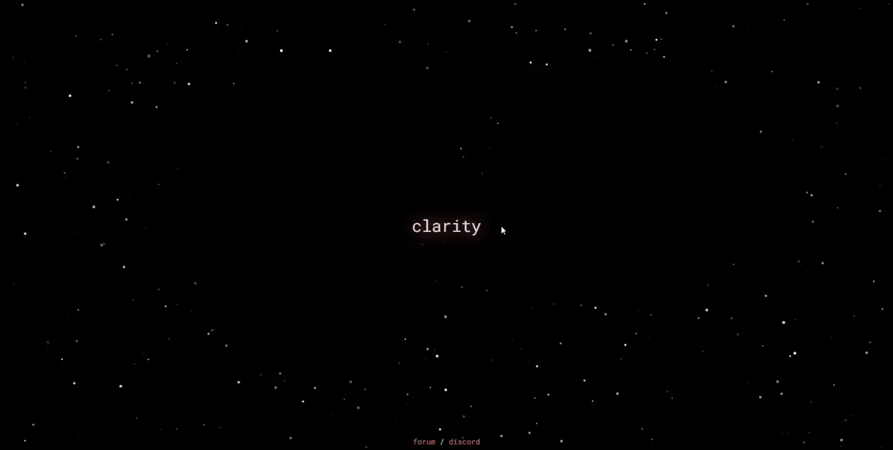
  
<em>The clarity.moe landing page: a minimal black starfield with the "clarity" wordmark and two links, forum and discord. Shared by kaury.</em>

  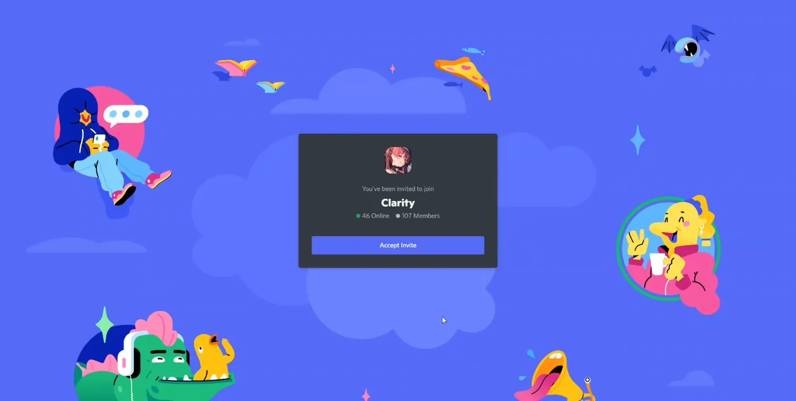
  
<em>The Clarity Discord invite (discord.gg/aqn): 107 members, 46 online at capture. Shared by kaury.</em>

  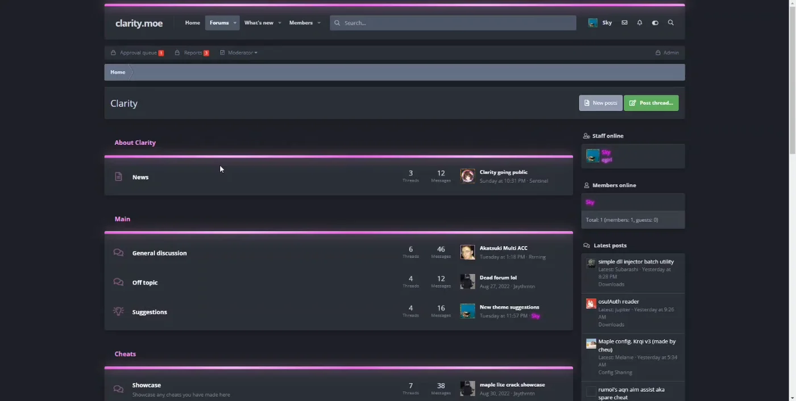
  
<em>The clarity.moe forum home, browsed from a staff account (Sky). Categories About Clarity, Main, and Cheats, with a "Latest posts" panel listing a dll injector, an osu!Auth reader, and a Maple config. Shared by kaury.</em>

  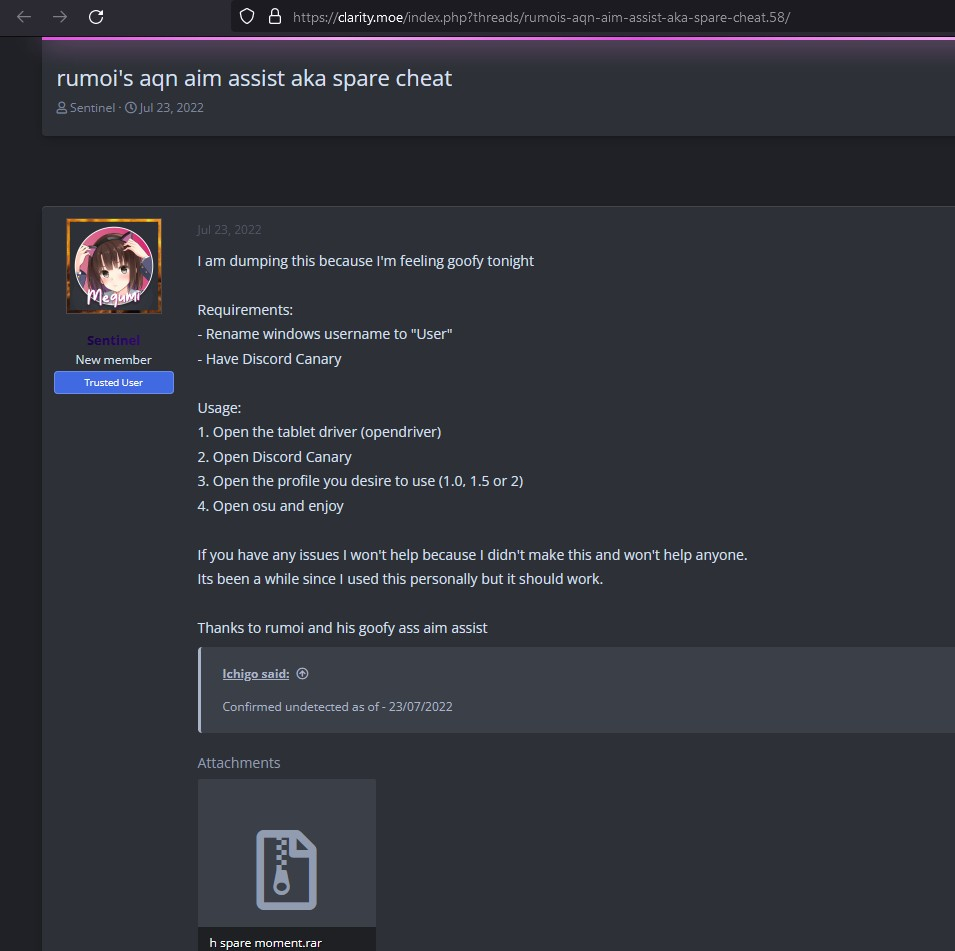
  
<em>The clarity.moe thread that first surfaced this cheat: it repackages Rumoi's AQN aim assist, disguised as a tablet driver process via Discord Canary.</em>

### Saturn

> _A standalone osu! cheat by ichigo (saturncheat.xyz) with aim assist, relax, timewarp, and Enlighten._

- **Status:** Archived · saturncheat.xyz · Lost to time
- **History Preview:** [fishy.moe/saturn](https://fishy.moe/client-cheating-archive#saturn)
- **Type:** Standalone
- **Maintainer:** ichigo (owner and maintainer)
- **Download:** Ran at saturncheat.xyz, now offline. No public download survives.
- **Cheats:**
  - Aim Assist (Kinetic type, adjustable power)
  - Relax
  - Timewarp
  - Enlighten

> [!NOTE]
>  **Provided by [Rizky (ptrchain)](https://github.com/ptrchain):** Owned and maintained by **ichigo**, who ran it at `saturncheat.xyz`. A showcase of the client is still up on YouTube: [youtu.be/xjw2O06m9JE](https://youtu.be/xjw2O06m9JE). Ichigo has offered to share the material he still has, so more screenshots and history should follow.

 

  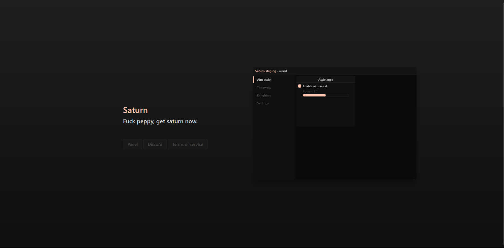
  
<em>The old saturncheat.xyz website, with the client's menu overlaid. Panel, Discord, and Terms of service links sat beneath the Saturn wordmark.</em>

  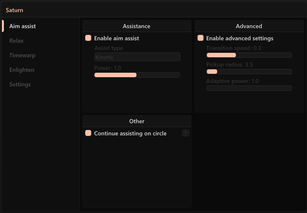
  
<em>Saturn's Aim assist panel: assist type Kinetic, adjustable power, and an Advanced section with transition speed, pickup radius, and adaptive power sliders.</em>

  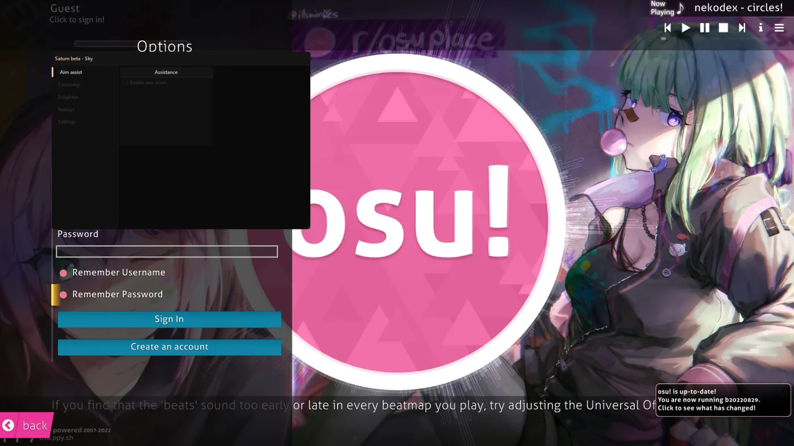
  
<em>A live in-client capture of the Saturn beta (menu labelled "Saturn beta - Sky"): the Aim assist panel open over the osu! main menu, alongside Timewarp, Enlighten, Replays, and Settings tabs. Shared by kaury.</em>

### Iceware

> _A private cheat reportedly built for Akatsuki players, kept privately rather than released._

- **Status:** Archived · Private · Not released
- **History Preview:** [fishy.moe/iceware](https://fishy.moe/client-cheating-archive#iceware)
- **Download:** Not released, and not planned to be. Kept privately for archival purposes only.
- **Cheats:**
  - Aim Assist (plus a second, separate aim-assist variant)
  - Relax
  - Enlighten
  - Spoofer
  - Misc

> [!NOTE]
> What little is documented here comes from a recovered project structure, not a tested build, so take it as a rough sketch rather than a confirmed feature list. It appears to be written in C#/.NET, using the Harmony patching library and a bundled FASM assembler, based on the recovered source. Developer unconfirmed and intentionally not named here. Kept privately, not released, and not being actively pursued out of respect for the people around it.

### Lycoris

> _A public cheat by cyw, sold at lycoris.gg until he exit scammed the userbase. Its surviving menu screenshots still carry default, unbranded control labels._

- **Status:** Archived · lycoris.gg · Exit scammed · Abandoned
- **History Preview:** [fishy.moe/lycoris](https://fishy.moe/client-cheating-archive#lycoris)
- **Cost:** Paid
- **Maintainer:** cyw (developer)
- **Download:** Was sold at lycoris.gg. The developer, cyw, later exit scammed the userbase, and no public download survives. All that surfaced is a useless `.exe`, with no source and no working build.

> [!NOTE]
>  **Confirmed by [Rizky (ptrchain)](https://github.com/ptrchain):** Confirmed to be the work of a developer going by **cyw**, which was public knowledge at the time. It was sold at `lycoris.gg` until cyw exit scammed the userbase and disappeared. The two known menu screenshots below still show generic, default-looking control labels ("tab", "subtab", "checkbox", "slider float", "accent color", "combo") rather than named features, so they are not from the branded production build.

 

  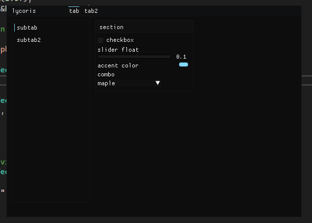
  
<em>Lycoris' menu, blue accent variant. Labels still read as generic/default rather than branded.</em>

  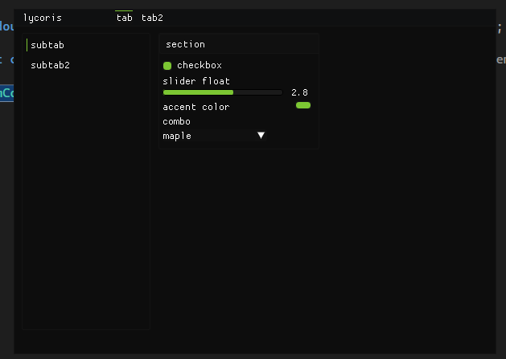
  
<em>The same menu with the accent color switched to green and different control values.</em>

## 

### JuicyBot

  <a href="https://juicybot.xn--5tzm5g/">
    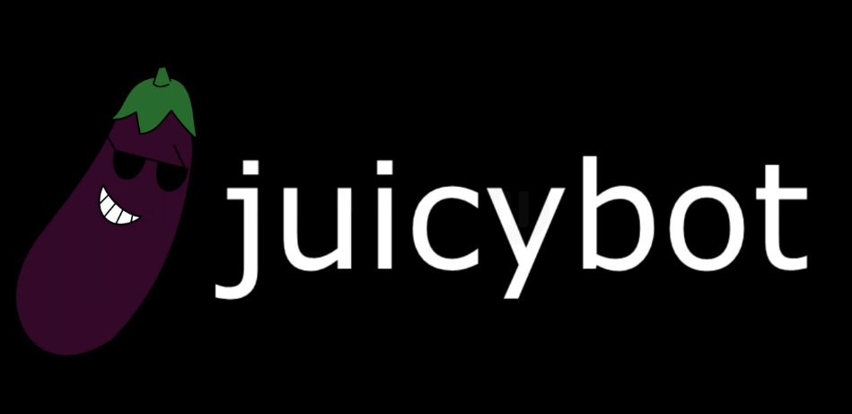
  </a>

> _A rare, invite-only Chinese osu! performance-enhancer by xi\_nao, marketed for osu!catch and undetectability._

- **Status:** Unknown · Invite-only · Rare · Paid
- **History Preview:** [fishy.moe/juicybot](https://fishy.moe/client-cheating-archive#juicybot)
- **Type:** Standalone
- **Cost:** Paid
- **Maintainer:** xi\_nao
- **Download:** [juicybot.网站](https://juicybot.xn--5tzm5g/) *(the site is public, but it's extremely selective about who it actually admits)*
- **Capabilities:**
  - **Taiko Auto-Bot:** a full taiko auto-bot mode, labeled TAIKOMANIA in-client. Confirmed from a closed-beta screenshot.
  - **osu!catch Focus:** marketed in its own promotional video as a top pick for osu!catch; specifics beyond that aren't documented.
  - **Human-Like Performance:** marketed to mimic natural human gameplay patterns rather than a fixed pattern. Not independently verified.
- **Notable:**
  - Marketed 99.9% undetected, 0 bans on record (per its own landing page)
  - Invite-only, reportedly ~15 slots per product in its European expansion
- **Promotional video:** [juicybot.网站 promotional video #1 (best osu!catch cheat)](https://www.youtube.com/watch?v=7WQ__7NfLBQ)

> [!NOTE]
>  **Provided by [Rizky (ptrchain)](https://github.com/ptrchain):** All information here (the client, the logo, the landing-page history, and the promotional video below) came from Rizky, who got into JuicyBot's own invite-only Discord community, where it's rarely documented outside that circle. He relayed what's shared there rather than testing the live client himself, to avoid getting banned and having his data sold. JuicyBot is reportedly still active and updated, and recently expanded into the European market at around 15 slots per product, so despite how rare it is, it's deliberately not filed under Legacy / Archive. Its client menu never made it past closed beta, so beyond the confirmed taiko auto-bot and its osu!catch marketing, the rest of its feature set is undocumented.

 

  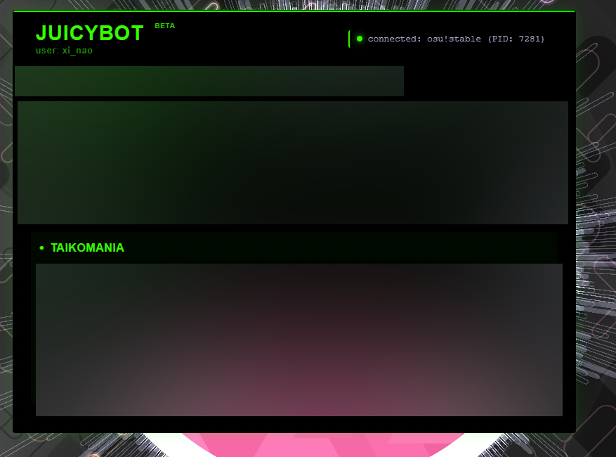
  
<em>The JuicyBot beta client, connected to osu!stable, mid-way through a Taikomania (taiko auto-bot) run.</em>

  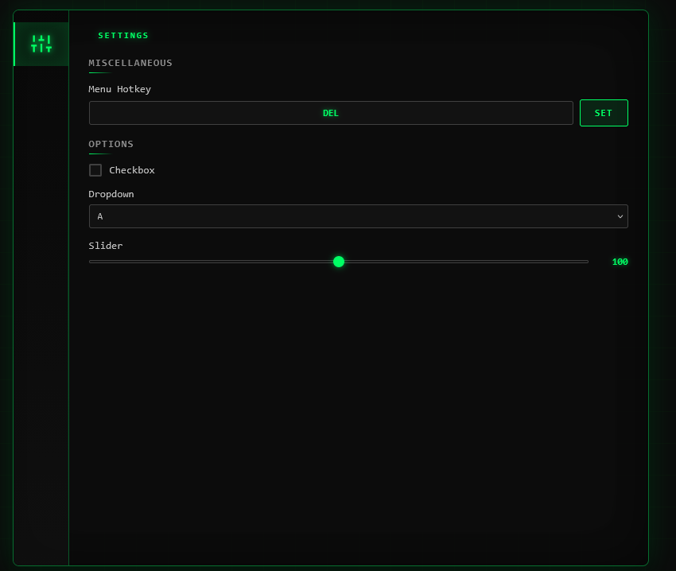
  
<em>A closed-beta settings panel with only placeholder controls wired up.</em>

  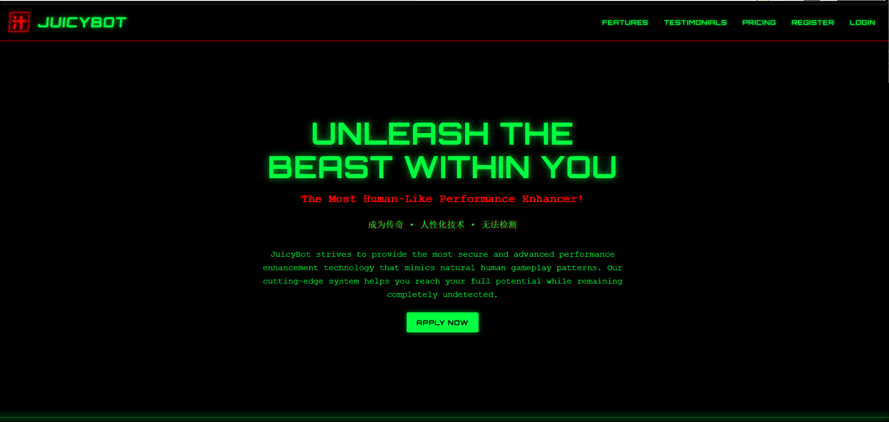
  
<em>The earliest known JuicyBot landing page.</em>

  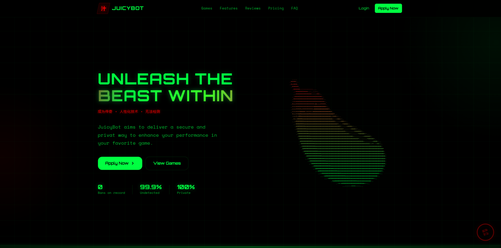
  
<em>A later redesign, adding a stats strip (bans on record, undetected, private).</em>

  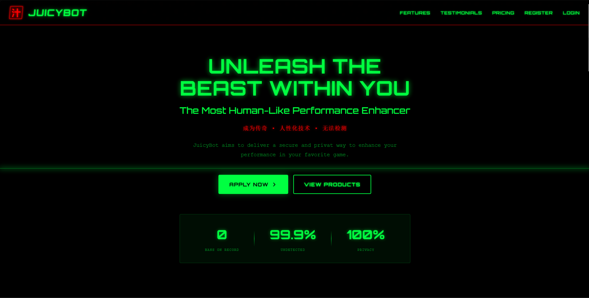
  
<em>The most recent redesign found.</em>

## Resources

### Patched osu! b20220424

> _Base client required by [osu!rx](#osu-rx) and other legacy hacks._

- **Status:** Archival snapshot
- **Download1:** [fishy.moe snapshot (b20220424.zip)](https://fishy.moe/download/osu-b20220424)
- **Download2:** [osekai.net snapshot (b20220424.zip)](https://osekai.net/snapshots/versions/b20220424/b20220424.zip)
- **Notes:** Now mirrored on fishy.moe storage as well, so the build survives if osekai goes down. The osu! binaries are untouched and ppy-signed; only a bundled repair shortcut that leaked the original packager's PC details was removed. The alternate Discord CDN mirror was taken down after going offline in 2025, leaving osekai.net as the canonical upstream source.

## Feature comparison

| Feature | Arc | Aeris | pawclient | OSU!RISE | Maple |
|---|:---:|:---:|:---:|:---:|:---:|
| Aim Assist / Correction | ✅ | ✅ | ❌ | ✅ | ✅ |
| Relax Hack | ✅ | ✅ | ✅ | ✅ | ✅ |
| Timewarp | ✅ | ✅ | ✅ | ❌ | ✅ |
| AR / CS Changer | ✅ | ✅ | ✅ | ✅ | ✅ |
| HD / FL Remover | ✅ | ✅ | 🟠 | ✅ | ✅ |
| Cost | Free | Free | Free | 💰 Paid | 💰 Paid |
| Works on current osu!/kawata | ✅ | ✅ | ❌ | ✅ | 🟠 |

| Client | Status | Cost | Type | Current osu/kawata | Download |
|---|---|:---:|:---:|:---:|:---:|
| [**Arc**](#arc) |  | Free | Standalone | ✅ | [fishy.moe/download/arc](https://fishy.moe/download/arc) |
| [**pawclient**](#pawclient) |  | Free | Standalone | ❌ | [fishy.moe/download/pawclient](https://fishy.moe/download/pawclient) |
| [**OSU!RISE**](#osu-rise) |  | 💰 Paid | Loader | ✅ | [osurise.online](https://osurise.online/?ref=QCXBQ3ZH) |
| [**Aeris**](#kawata-aeris) |  | Free | Standalone | ✅ | [fishy.moe/download/aeris](https://fishy.moe/download/aeris) |
| [**Maple**](#maple) |  | 💰 Paid | Standalone | 🟠 | _leak (archived)_ |
| [**AQN Revived V3**](#aqn-revived-v3) |  | TBD | TBD | TBD | [theaquila.network](https://theaquila.network) |
| [**??????**](#mystery-client) |  | TBD | TBD | TBD | _unreleased_ |
| [**AQN V0 + V1 + V2**](#aqn) |  | Free | Standalone | ❌ | [github.com/rumoi/AQN_nologin](https://github.com/rumoi/AQN_nologin) |
| [**freedom**](#freedom) |  | Free | DLL inject | ❌ | [fishy.moe/download/freedom-0-98](https://fishy.moe/download/freedom-0-98) |
| [**Ainu**](#ainu) |  | Free | Standalone | ❌ | _in testing_ |
| [**Auto Assist Megumi**](#megumi) |  | Free | DLL inject | ❌ | _in testing_ |
| [**Abypass**](#abypass) |  | Free | Standalone | ❌ | _in testing_ |
| [**Skooter**](#skooter) |  | Free | Standalone | ❌ | _in testing_ |
| [**tuyosu**](#tuyosu) |  | Free | Standalone | ❌ | [fishy.moe/download/tuyosu](https://fishy.moe/download/tuyosu) |
| [**paw!cheats**](#paw-cheats) |  | Free | Standalone | ❌ | _Archived (waiting approval)_ |
| [**Shaymi**](#shaymi) |  | Free | Standalone | ❌ | _Archived (waiting approval)_ |
| [**osu!rx**](#osu-rx) |  | Free | b20220424 | ❌ | _in testing_ |
| [**OsuAuth**](#osuauth) |  | TBD | DLL inject | ❌ | _never public_ |
| [**Clarity**](#clarity) |  | TBD | TBD | TBD | _lost to time_ |
| [**Saturn**](#saturn) |  | TBD | Standalone | TBD | _undocumented_ |
| [**Iceware**](#iceware) |  | TBD | TBD | TBD | _kept private_ |
| [**Lycoris**](#lycoris) |  | 💰 Paid | TBD | TBD | _no usable build_ |
| [**JuicyBot**](#juicybot) |  | 💰 Paid | Standalone | 🟠 | _never public_ |

<!-- 
🟢 Active &nbsp;·&nbsp; 🟠 Under maintenance &nbsp;·&nbsp; ⚪ Legacy / archived -->

## Want to test your own cheat?

  <a href="https://dev.fishy.moe">
    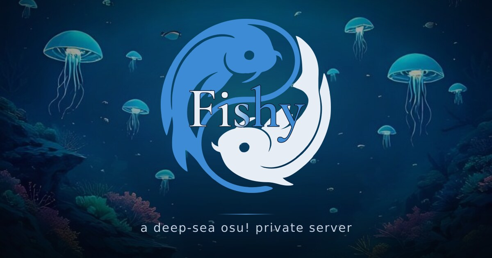
  </a>

<a href="https://dev.fishy.moe">dev.fishy.moe</a> is a special playground for testing & developing unreleased cheats to apply in future for kawata.pw. It runs a <a href="https://github.com/kawatapw/kawata.py">kawata backend</a> with customizations from <a href="https://github.com/osu-NoLimits/bancho.py-ex">bancho.py-ex</a>. The backend is fully reworked and rewritten for this purpose, so it stands as a "sister" build of kawata dedicated to testing.

To connect a cheat or osu! client for testing, launch osu! with the `-devserver fishy.moe` switch, then log in with your <a href="https://dev.fishy.moe">fishy.moe</a> account. The server runs fully over HTTPS, so the client reaches it on the standard bancho subdomains without extra setup. Full steps are on the <a href="https://dev.fishy.moe/rules">fishy.moe rules and connection guide</a>.

### Need to host or back up your cheat?

Beyond testing, we can also host a download URL for your cheat on fishy.moe. If your own mirror link breaks or you do not run a server, we can store a backup so others can still use your work. Everything we host lives under <a href="https://fishy.moe/download">fishy.moe/download</a>, where each cheat gets its own stable link. The <a href="#tuyosu">tuyosu</a> entry above is one example: with the developer's permission it now ships from a stable <a href="https://fishy.moe/download/tuyosu">fishy.moe/download/tuyosu</a> link that will not expire. Get in touch if you want the same for your client.

## Cheating Private Servers

A directory of the osu! private servers known to allow the cheating clients listed in this archive:

<table>
  <tr>
    <td align="center" width="150">
      <a href="https://pawinput.xyz/">
         
        <b>Pawtoka</b>
      </a>
    </td>
    <td>
      <a href="https://pawinput.xyz/">Website</a> &nbsp;·&nbsp; <a href="https://discord.gg/2Etdy8nnwY">Discord</a>
    </td>
  </tr>
  <tr>
    <td align="center" width="150">
      <a href="https://kawata.pw">
         
        <b>Kawata</b>
      </a>
    </td>
    <td>
      <a href="https://kawata.pw">Website</a> &nbsp;·&nbsp; <a href="https://discord.gg/cJB99QnMqW">Discord</a>
    </td>
  </tr>
  <tr>
    <td align="center" width="150">
      <a href="https://fishy.moe/">
         
        <b>fishy.moe</b>
      </a>
    </td>
    <td>
      <a href="https://fishy.moe/">Website</a> &nbsp;·&nbsp; <a href="https://discord.gg/p37MQAtFdX">Discord</a>
    </td>
  </tr>
  <tr>
    <td align="center" width="150">
      <a href="https://halcyon.moe">
         
        <b>Halcyon</b>
      </a>
    </td>
    <td>
      <a href="https://halcyon.moe">Website</a> &nbsp;·&nbsp; <a href="https://discord.gg/CS2yHM3B">Discord</a>
    </td>
  </tr>
  <tr>
    <td align="center" width="150">
      <a href="https://osunolimits.dev">
        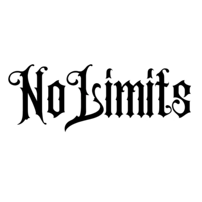 
        <b>NoLimits</b>
      </a>
    </td>
    <td>
      <a href="https://osunolimits.dev">Website</a> &nbsp;·&nbsp; <a href="https://discord.gg/2Q4tFfy74Z">Discord</a>
    </td>
  </tr>
</table>

This list is not exhaustive, and server policies vary, so always check a server's own rules before you play. Bancho, the official osu! server, bans these clients on score submission.

## Play legit?

  

The maintainer of this archive also runs a few free osu! tools on hinamizawa.ai, strictly non-cheating utilities for legit play and exploration:

- [**Beatmap Mirror**](https://hinamizawa.ai/osu/beatmaps/): Search and download. PP on every card across 14 mod combos. Leaderboards, fail graphs, background downloads. 10 cascading mirror sources, all 4 game modes.
- [**PP Farm Maps**](https://hinamizawa.ai/osu/pp-maps/): 144,000+ ranked beatmaps with pre-calculated PP for 14 mod combinations. Filter by PP range, star rating, BPM, mode.
- [**Beatmap Packs**](https://hinamizawa.ai/osu/map-packs/): 3,750+ curated packs across 7 categories (Standard, Featured Artist, Tournament, Loved, Spotlights, Theme, Artist), 263,000+ difficulties with PP per difficulty.
- [**Private Server List**](https://hinamizawa.ai/osu/servers/): A directory of every osu! private server found online, with live stats. All are strictly non-cheating servers and will ban on sight if you cheat on score submission.
- [**mirror.hinamizawa.ai**](https://mirror.hinamizawa.ai/): The API documentation site for the beatmap mirror backend that the Beatmap Mirror and PP Farm Maps above rely on. It is also used by other osu! mirrors and by GitHub tools built by other developers. It was a private mirror for about 2 months at first, then went partially public and later fully public with no rate limit, following requests from private servers. Officially launched publicly on March 2, 2026, built with Rust and DuckDB.

No login required.

## osu! Mirrors

Beatmap mirrors and open APIs for building osu! tools and services. These are the mirrors Hinai proudly stands alongside in the osu! community.

<table>
  <tr>
    <td align="center" width="150">
      <a href="https://mirror.hinamizawa.ai/">
         
        <b>Hinai</b>
      </a>
    </td>
    <td>
      US Mirror (Rust + DuckDB) beatmap mirror + osu!data hub, powering hinamizawa.ai. 
      <a href="https://mirror.hinamizawa.ai/">Website</a> &nbsp;·&nbsp; <a href="https://discord.gg/CVz4PKayTm">Discord</a> &nbsp;·&nbsp; <a href="https://github.com/alejandroatacho/hinai-beatmap-mirror">GitHub</a>
    </td>
  </tr>
  <tr>
    <td align="center" width="150">
      <a href="https://mirror.nekoha.moe/">
         
        <b>Nekoha</b>
      </a>
    </td>
    <td>
      German mirror (Js), open source, graveyard map specialist. 
      <a href="https://mirror.nekoha.moe/">Website</a> &nbsp;·&nbsp; <a href="https://discord.gg/QNCmZBqwBQ">Discord</a> &nbsp;·&nbsp; <a href="https://github.com/mirror-nekoha-moe">GitHub</a>
    </td>
  </tr>
  <tr>
    <td align="center" width="150">
      <a href="https://osu.direct/browse">
         
        <b>osu.direct</b>
      </a>
    </td>
    <td>
      German mirror (likely Typescript & more), one of the top two mirrors. 
      <a href="https://osu.direct/browse">Website</a> &nbsp;·&nbsp; <a href="https://discord.gg/zcneqapZ8g">Discord</a> &nbsp;·&nbsp; <a href="https://github.com/HorizonCode">GitHub</a>
    </td>
  </tr>
  <tr>
    <td align="center" width="150">
      <a href="https://nerinyan.moe/main">
         
        <b>NeriNyan</b>
      </a>
    </td>
    <td>
      South Korean mirror(Go+Python), hosted in South Korea and Japan. 
      <a href="https://nerinyan.moe/main">Website</a> &nbsp;·&nbsp; <a href="https://discord.gg/StNbVPT7y7">Discord</a> &nbsp;·&nbsp; <a href="https://github.com/Nerinyan">GitHub</a>
    </td>
  </tr>
</table>

All of these mirrors are integrated in [kawata.pw](https://kawata.pw).

## Contributing

  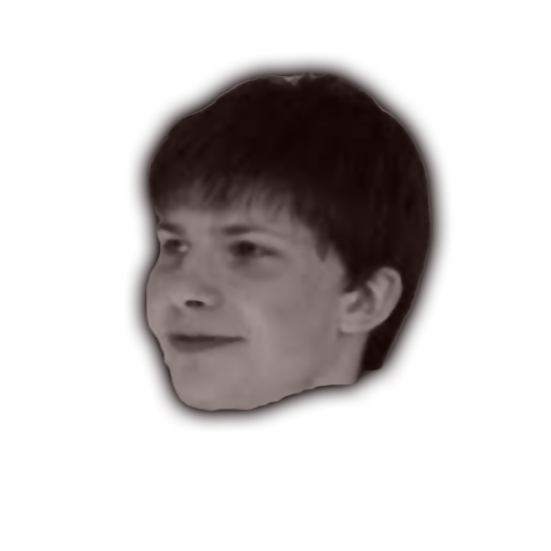

This is a curated archive. PRs welcome for:

- Corrections to existing entries (broken links, updated maintainers, status changes)
- New legacy / archived clients with historical significance
- Fresh virus-analysis links (Hybrid Analysis, VirusTotal)

PRs adding **new actively-developed cheat clients** are reviewed case-by-case, so please open an issue first. Every download link must be paired with a virus-scan link.

## Contributors: 11

<table>
  <tr>
    <td align="center" width="140">
      <a href="https://github.com/alejandroatacho">
         
        <b>hinamizawa</b>
      </a>
    </td>
    <td>
      Originally moderator and guide writer for <a href="#aqn">AQN (V0 + V1 + V2)</a>; now Administrator &amp; Developer at <a href="https://kawata.pw/u/12396">Kawata</a>, Overwatcher/Moderator at <a href="https://osu.gatari.pw/u/17181">Gatari</a> and Owner / Solo Developer of <a href="https://hinamizawa.ai">hinamizawa.ai</a>, <a href="https://fishy.moe">fishy.moe</a> & <a href="https://mirror.hinamizawa.ai/">mirror.hinamizawa.ai</a>. Currently also hosting <a href="https://kawata.pw">kawata.pw</a> and the <a href="#kawata-aeris">Aeris</a> auto updater while Loki is away.
    </td>
  </tr>
  <tr>
    <td align="center" width="140">
      <a href="https://github.com/Xyrohh">
         
        <b>Hugo (Xyrohh)</b>
      </a>
    </td>
    <td>
      Co-Owner and Global Community &amp; Media Manager at <a href="https://kawata.pw/u/13233">Kawata</a>.
    </td>
  </tr>
  <tr>
    <td align="center" width="140">
      <a href="https://github.com/ptrchain">
         
        <b>Rizky (ptrchain)</b>
      </a>
    </td>
    <td>
      Owner of <a href="#aqn-revived-v3">AQN Revived V3</a> and Moderator at <a href="https://maple.software/">maple.software</a>. Provided multiple screenshots for old and otherwise-lost clients, including <a href="#maple">Maple</a>, <a href="#megumi">Auto Assist Megumi</a>, <a href="#saturn">Saturn</a>, <a href="#lycoris">Lycoris</a>, and <a href="#osuauth">OsuAuth</a>, plus background history on maple.software not otherwise publicly documented, design lore behind the AQN and Megumi websites, and the megumi.dev ownership situation (owned and maintained by czapek, not kat).
    </td>
  </tr>
  <tr>
    <td align="center" width="140">
      <a href="https://github.com/TheFantasticLoki">
         
        <b>TheFantasticLoki</b>
      </a>
    </td>
    <td>
      Owner and Lead Developer of <a href="https://kawata.pw/u/1488">Kawata</a> and the <a href="#kawata-aeris">Aeris</a> client. Indirect contributor. The upstream <a href="https://kawata.pw/u/1488">Kawata</a> docs are also one of this archive's sources of information.
    </td>
  </tr>
  <tr>
    <td align="center" width="140">
      <a href="https://github.com/nyoemii">
         
        <b>noemi (nyoemii)</b>
      </a>
    </td>
    <td>
      Developer of <a href="#tuyosu">tuyosu</a> and co-developer of <a href="#shaymi">Shaymi</a> (with <a href="https://github.com/SimplyAe">miracle</a>), Alumni of <a href="https://kawata.pw">Kawata</a> - <a href="#kawata-aeris">Aeris</a> Client. Contributed to this archive and gave permission to host the last worked-on version of tuyosu on <a href="https://fishy.moe">fishy.moe</a>, free to download so it stays available online.
    </td>
  </tr>
  <tr>
    <td align="center" width="140">
      <a href="https://github.com/SimplyAe">
         
        <b>miracle (SimplyAe)</b>
      </a>
    </td>
    <td>
      Developer of <a href="#paw-cheats">paw!cheats</a> and <a href="#pawclient">pawclient</a>, co-developer of <a href="#shaymi">Shaymi</a> (with <a href="https://github.com/nyoemii">noemi</a>), and runs the Pawtoka private server (<a href="https://pawinput.xyz/">pawinput.xyz</a>). Provided them, along with screenshots and information, for this archive, including the <a href="#ainu">Ainu</a> rumor note.
    </td>
  </tr>
  <tr>
    <td align="center" width="140">
      <a href="https://github.com/kird3333d">
         
        <b>cbKocham (kird3333d)</b>
      </a>
    </td>
    <td>
      Flagged the <a href="#megumi">Auto Assist Megumi</a> revival link as dead and dangerous during a community review, prompting its removal from this archive, and provided a final build from Kat's team for backup, archival, and testing purposes.
    </td>
  </tr>
  <tr>
    <td align="center" width="140">
       
      <b>kaury</b>
    </td>
    <td>
      Provided rare footage and screenshots of old and otherwise-lost clients: a live capture of the <a href="#clarity">Clarity</a> forum and Discord, a developer build of <a href="#megumi">Auto Assist Megumi</a>, and an in-client shot of <a href="#saturn">Saturn</a>.
    </td>
  </tr>
  <tr>
    <td align="center" width="140">
       
      <b>drown</b>
    </td>
    <td>
      Bug hunter and reporter for <a href="https://kawata.pw">Kawata</a> and the <a href="#kawata-aeris">Aeris</a> client, and a member of the Support team.
    </td>
  </tr>
  <tr>
    <td align="center" width="140">
      <a href="https://github.com/7ez">
         
        <b>Aochi</b>
      </a>
    </td>
    <td>
      Original owner of Fuquila and alumni Backend Developer at <a href="https://kawata.pw">Kawata</a>. Now Solo Developer and Maintainer of <a href="#arc">Arc</a>, with many contributions to other osu! projects around the community.
    </td>
  </tr>
  <tr>
    <td align="center" width="140">
      <a href="https://github.com/iotazz">
         
        <b>iotazz (Aleks)</b>
      </a>
    </td>
    <td>
    2023 MPGH File testers and unsafe urls; <a href="https://kawata.pw">Kawata</a> Support/Gestion alumni.
    </td>
  </tr>
</table>

---

Information data found via ban appeals on private servers & self research/communication with the underground community · some information mirrored from <a href="https://kawata.pw">Kawata</a>'s in-game cheat docs · Old Legacy entries preserved from the 2023 archive original research team.

---

  

